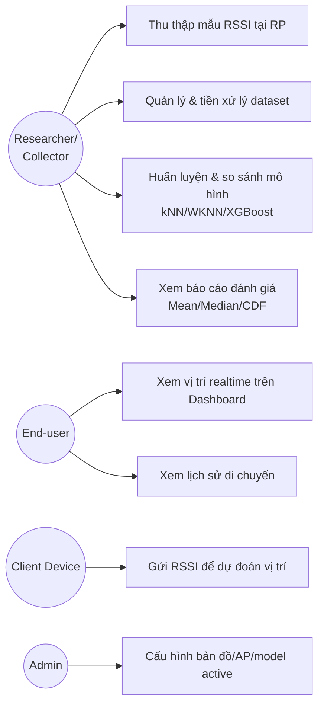
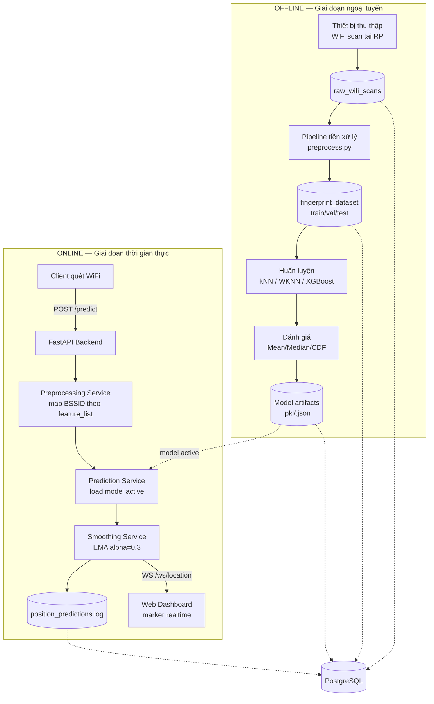
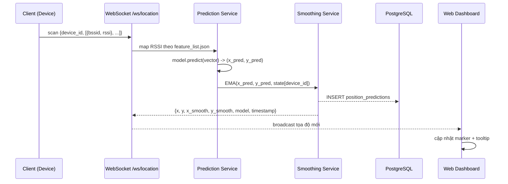
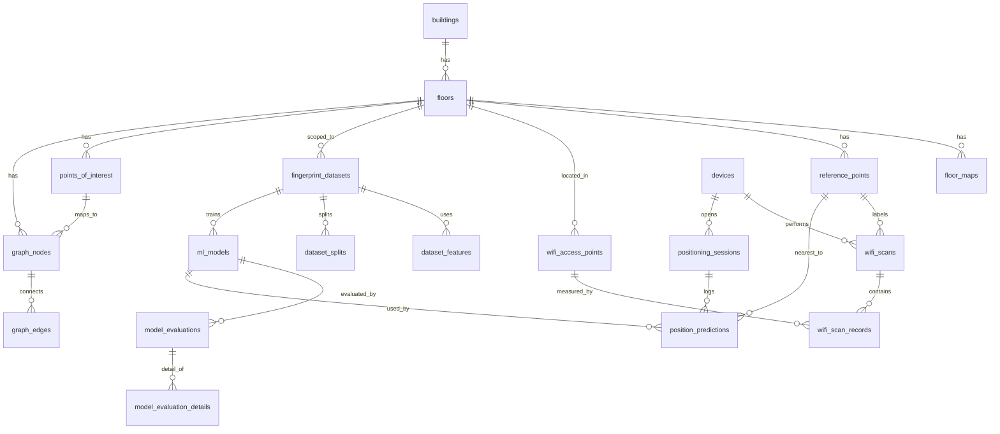

# Phân tích & Thiết kế Hệ thống — Đồ án "Nghiên cứu hệ thống định vị trong nhà và xây dựng ứng dụng" (Nhóm 15)

Bản phân tích & thiết kế hệ thống tổng hợp từ: đề cương của nhóm (`Nhom15_DeCuong_DATN_edited.docx`), kế hoạch phân tích chi tiết (`Kế Hoạch_phantichh_CB.docx`), đề cương/báo cáo đồ án cũ CTK45 mà nhóm kế thừa (`DATN_CTK45_IPS.pdf`), thiết kế Figma (`Design_Figma_SystemIndoor.docx`), và thiết kế CSDL PostgreSQL (`Thiết Kế Database PostgreSQL Cho Dự Án Indoor Positioning System.docx`). Viết theo cấu trúc Chương 2 trong đề cương của nhóm, để có thể chép trực tiếp vào báo cáo.

---

## 2.0. Vị trí đề tài trong dòng kế thừa

Đồ án cũ (CTK45, thư viện tầng 1 ĐH Đà Lạt) đã làm gì, và đồ án của Nhóm 15 kế thừa/khác ở đâu — đây là phần **"điểm mới"** giám khảo sẽ hỏi đầu tiên, nên cần nói rõ ràng, có số liệu đối chứng:

| Khía cạnh | Đồ án cũ (CTK45 – kế thừa) | Đồ án Nhóm 15 (đề xuất) |
|---|---|---|
| Bài toán ML | **Phân lớp** RSSI → RP_ID, sau đó tra tọa độ RP trong DB | **Hồi quy** RSSI → (x, y) trực tiếp — đánh giá được sai số mét liên tục, không bị lượng tử hóa theo lưới RP |
| Mô hình | KNN, WKNN, Random Forest, CNN (Conv1D 16-32-64 + Dense) phân lớp | KNN, WKNN (baseline) + **XGBoost Regression** (2 mô hình con cho x, y) là mô hình chính; Random Forest là phương án so sánh nếu còn thời gian |
| Kết quả đã có (để trích dẫn/so sánh) | Phòng thí nghiệm: RF 97.16%/6.02 m, KNN 89.5%/9 m, WKNN 88.7%/8 m, CNN 92%/5 m. Thực tế: RF 5–8 m, KNN 7–12 m, WKNN 6–11 m, CNN 0–8 m | Mục tiêu: sai số trung bình thấp hơn KNN/WKNN 10–20%, CDF90 giảm rõ rệt so với baseline |
| Dữ liệu | 40 RP, cách nhau ~7 m, 3200 mẫu (80 mẫu/RP × 4 hướng), 13 trường thô, rút gọn còn 37/8 đặc trưng AP, RSSI thiếu = -98 | Kế thừa đúng quy ước: RSSI thiếu = -98, ngưỡng tối thiểu 6 AP/mẫu, 30–80 mẫu/RP; bổ sung 3 cấu hình lựa chọn AP (toàn bộ / ≥20% xuất hiện / top 10–15) và quy tắc chống rò rỉ dữ liệu (fit scaler chỉ trên train) |
| Sản phẩm đầu ra | App di động Flutter, chỉ đường bằng giọng nói, AR/3D (một phần là mở rộng lý thuyết, chưa chắc đã cài đặt) | **Web Dashboard** (không phải mobile), hiển thị vị trí **realtime qua WebSocket** trên sơ đồ mặt bằng |
| Backend/CSDL | FastAPI (REST) + MongoDB Atlas | FastAPI + WebSocket + **PostgreSQL** (xem ghi chú mâu thuẫn bên dưới) |
| Hậu xử lý vị trí | Không đề cập | **EMA smoothing** (alpha = 0.3) để giảm dao động marker |
| Phạm vi | Toàn bộ tầng 1 thư viện, có định hướng mở sang AR/đa nền tảng | Giữ nguyên phạm vi 2D một tầng, **chủ động không** làm đa tầng/GPS/BLE/CNN để tập trung chất lượng mô hình |

**Cách viết "điểm mới" trong báo cáo** (đã đúng hướng theo file kế hoạch): nhấn mạnh **hồi quy tọa độ trực tiếp** thay vì phân lớp RP, **XGBoost** khai thác tốt dữ liệu bảng RSSI, đánh giá bằng **sai số mét chuẩn hóa (CDF)** thay vì accuracy phân lớp, và triển khai **realtime Web Dashboard**. Không nêu "xây dựng app định vị" làm điểm mới vì đồ án cũ đã làm.

⚠️ **Mâu thuẫn cần xử lý trước khi nộp báo cáo chính thức:** đề cương (`Nhom15_DeCuong_DATN_edited.docx`, mục V) ghi **SQLite**, nhưng tài liệu thiết kế CSDL riêng lại đề xuất **PostgreSQL**. Hai tài liệu này không khớp nhau. Bên dưới khuyến nghị chọn PostgreSQL làm quyết định cuối cùng (lý do ở mục 2.5), nhưng nhóm cần **sửa lại mục V của đề cương** cho khớp — hội đồng rất hay bắt lỗi loại này.

---

## 2.1. Phân tích yêu cầu

### 2.1.1. Tác nhân (Actors)

| Actor | Vai trò |
|---|---|
| **Researcher/Collector** (thành viên nhóm) | Thu thập dữ liệu offline tại các RP, quản lý dataset, huấn luyện & đánh giá mô hình |
| **End-user (Viewer)** | Mở Web Dashboard, xem vị trí hiện tại của mình (hoặc thiết bị test) theo thời gian thực |
| **System/Client device** | Actor phi con người: điện thoại/laptop quét RSSI và gửi lên backend qua HTTP hoặc WebSocket |
| **Admin** (mở rộng) | Cấu hình bản đồ, danh sách AP, chọn model đang active |

### 2.1.2. Use case chính

### 2.1.3. Yêu cầu chức năng (đã nhóm theo module — khớp với 5 chương trong đề cương)

1. **Thu thập & tiền xử lý tín hiệu**: quét RSSI, gắn nhãn RP/tọa độ, chuẩn hóa cột AP theo BSSID, xử lý AP không phát hiện (-98), loại mẫu <6 AP, loại AP nhiễu/hiếm gặp, chia train/val/test không rò rỉ dữ liệu.
2. **Ước lượng tọa độ**: nhận vector RSSI → trả (x, y) bằng model đang active, làm mượt bằng EMA.
3. **Truyền dữ liệu thời gian thực**: WebSocket phát tọa độ mới mỗi khi có dự đoán; REST dùng cho các thao tác không cần realtime.
4. **Hiển thị trực quan**: Dashboard vẽ marker trên sơ đồ mặt bằng, trạng thái kết nối, RSSI panel, thẻ tọa độ hiện tại.
5. **Quản lý thực nghiệm**: lưu vết dataset/model theo phiên bản để tái lập kết quả, so sánh kNN/WKNN/XGBoost bằng bảng & biểu đồ CDF.

### 2.1.4. Yêu cầu phi chức năng

| Loại | Yêu cầu |
|---|---|
| Hiệu năng | Độ trễ dự đoán 1 mẫu (từ lúc nhận RSSI đến khi trả tọa độ) nên < 200 ms; model load **một lần khi khởi động** backend, không load lại mỗi request |
| Độ chính xác | Sai số trung bình XGBoost thấp hơn kNN/WKNN tối thiểu 10–20%; CDF90 < baseline |
| Khả năng tái lập | Mọi dataset/model phải gắn version, có thể huấn luyện lại từ đầu ra cùng kết quả (cố định `random_state=42`) |
| Khả năng mở rộng | Schema và kiến trúc phải chịu được việc thêm tầng/tòa nhà/route-finding sau này mà không đổi core |
| Khả dụng | Nếu mất kết nối WebSocket, Dashboard phải hiển thị rõ trạng thái "Disconnected", không đứng hình marker cũ mà không cảnh báo |
| Bảo mật (mức tối thiểu cho đồ án) | Endpoint ghi dữ liệu training/cấu hình nên có xác thực đơn giản (API key/basic auth); endpoint đọc công khai cho Dashboard |

---

## 2.2. Kiến trúc hệ thống tổng thể

Hệ thống chia 2 luồng: **Offline (huấn luyện)** và **Online (thời gian thực)**, dùng chung tầng dữ liệu.

**Giải thích các thành phần:**

- **Data Collection**: script/ứng dụng nhỏ (web form hoặc CLI) ghi RSSI thô kèm `rp_id, x, y, device_id, direction, bssid, rssi`.
- **Preprocessing pipeline** (`ml/preprocess.py`): chuẩn hóa AP theo BSSID, xử lý thiếu, lọc mẫu/AP kém, scaling (fit trên train only), xuất `fingerprint_dataset.csv`, `feature_list.json`.
- **Training pipeline**: huấn luyện song song kNN/WKNN (baseline) và XGBoost (2 mô hình con `model_x`, `model_y`); lưu artifact + `model_metadata.json`.
- **Backend FastAPI**: expose REST (`/predict`, `/map`, CRUD dữ liệu) + WebSocket (`/ws/location`); load model **một lần lúc start** để đảm bảo độ trễ thấp.
- **Smoothing Service**: EMA theo từng `device_id`/`session`, có rule reset nếu mất tín hiệu lâu, giới hạn bước nhảy tối đa.
- **Web Dashboard**: HTML5 + Tailwind CSS, kết nối WebSocket, vẽ marker lên sơ đồ mặt bằng bằng công thức quy đổi `pixel = origin + x*scale`.

---

## 2.3. Thiết kế luồng dữ liệu (Sequence)

**(a) Luồng dự đoán realtime — quan trọng nhất, nên đưa vào báo cáo dưới dạng sequence diagram:**

**(b) Luồng huấn luyện & đánh giá (offline):** Load `fingerprint_dataset` → fit scaler trên train → train kNN/WKNN/XGBoost → predict trên validation/test → tính `mean_error, median_error, cdf_50/75/90` → ghi `model_evaluations` + `model_evaluation_details` (từng mẫu, để vẽ heatmap lỗi) → chọn model tốt nhất, đặt `is_active = true`.

---

## 2.4. Thiết kế mô hình học máy

- **Phát biểu bài toán**: Input = vector RSSI `[AP_1, ..., AP_n]` (thiếu → -98); Output = `(x, y)` mét. Loss/đánh giá chính: `error = sqrt((x_pred-x_true)² + (y_pred-y_true)²)`.
- **Baseline 1 – kNN**: trung bình tọa độ của k mẫu train gần nhất; thử k ∈ {3,5,7,9,11}, distance ∈ {euclidean, manhattan}.
- **Baseline 2 – WKNN**: trọng số `1/(distance+ε)`, ε=1e-6, cùng dải k.
- **(Tùy thời gian) Random Forest**: `n_estimators` ∈ {100,200,500}, dùng làm mốc so sánh thêm với XGBoost — có sẵn số liệu đối chứng từ đồ án cũ (RF đạt 97.16%/6.02m trong bài toán phân lớp, nên kỳ vọng RF cũng là baseline mạnh trong bài toán hồi quy).
- **Mô hình chính – XGBoost Regression**: train riêng `model_x`, `model_y`; tham số thử `n_estimators∈{100,300,500}`, `max_depth∈{3,5,7}`, `learning_rate∈{0.03,0.05,0.1}`, `subsample/colsample_bytree∈{0.8,1.0}`, `reg_lambda∈{1,5,10}`, `random_state=42`.
- **Chỉ số đánh giá**: Mean/Median/Min/Max/Std error (m), CDF tại 50/75/90%, MAE/RMSE theo từng trục x, y, thời gian dự đoán (ms). Biểu đồ: CDF sai số, so sánh mean error giữa model, heatmap lỗi theo bản đồ, feature importance của XGBoost, sai số theo từng RP.
- **Chia dữ liệu**: cơ bản train/val/test = 70/15/15; nâng cao (nếu có nhiều thiết bị/thời điểm) — device-holdout và time-holdout để kiểm tra tổng quát hóa thực tế (đúng bài học từ đồ án cũ: kết quả phòng thí nghiệm 88–97% nhưng thực tế rớt xuống 5–12m — cần test bằng thiết bị khác/thời điểm khác ngay từ đầu để tránh optimistic bias).
- **Hậu xử lý**: EMA `x_smooth = α·x_new + (1-α)·x_old`, α=0.3 mặc định; reset nếu mất tín hiệu quá lâu; giới hạn bước nhảy tối đa.

---

## 2.4.1. Đối chiếu với bản đã thực hiện

Mục 2.4 ở trên là **thiết kế ban đầu**, giữ nguyên làm dấu vết quá trình. Sau khi
chạy thực nghiệm có năm chỗ khác đi. Mọi số liệu dưới đây đo trên tập test 118
mẫu, chọn mô hình chỉ dựa trên validation.

**1. Hậu xử lý: EMA thay bằng đồng thuận không gian.**

Thiết kế chọn EMA `x_smooth = α·x_new + (1-α)·x_old`. Thực nghiệm cho thấy các ca
sai nặng gần như luôn là *một* lần quét dị thường lẻ loi chứ không phải dao động
đều, mà EMA thì kéo trung bình nên vẫn bị điểm lạc lôi đi. Đồng thuận không gian
chọn dự đoán có tổng khoảng cách tới các dự đoán còn lại nhỏ nhất, nên luôn trả
về một điểm tham chiếu có thật và tự loại điểm lạc.

Đo trên tập test, gộp 3 lần quét:

| Cách gộp | Sai số trung bình | Lớn nhất | Số điểm sai |
|---|---|---|---|
| Một lần quét, không gộp | 1,92 m | 37,6 m | 13/39 |
| Bình chọn đa số | 0,59 m | 18,0 m | 2/39 |
| Trung vị toạ độ | 0,38 m | 15,0 m | 1/39 |
| **Đồng thuận không gian** | **0,38 m** | **15,0 m** | **1/39** |

Hai tham số `α` và giới hạn bước nhảy vì thế không còn, thay bằng `cua_so_gop`
(số lần quét gộp, mặc định 3) và `reset_after_seconds`.

**2. Thêm mô hình thứ năm không có trong thiết kế.** Dữ liệu chỉ có 39 toạ độ
khác nhau vì thu đúng tại các điểm tham chiếu, nên bài toán gần với phân lớp hơn
hồi quy. `kNN vân tay (Bray-Curtis)` khai thác đúng tính chất đó và cho 1,92 m,
so với 5,15 m của cơ sở tốt nhất và 6,48 m của XGBoost.

**3. Giá trị điền thiếu: −98 thành −96.** Không đặt cứng nữa mà tính từ dữ liệu:
`min(RSSI) − 1`. Dữ liệu thu được có RSSI thấp nhất −95 dBm.

**4. Lưới tham số mở rộng.** Ba lưới trong mục 2.4 có tối ưu rơi đúng vào biên —
`beta` cận trên, `n_neighbors` cận dưới, `reg_lambda` cận dưới — nên đã nới cho
tới khi cực trị nằm hẳn bên trong. Riêng lưới XGBoost giữ đúng 6 tham số như
thiết kế, chỉ thêm giá trị `reg_lambda = 0,5` và `colsample_bytree = 0,6`.

**5. `device_holdout` và `time_holdout` không thực hiện được.** Toàn bộ dữ liệu
thu bằng một máy Samsung SM-S908E, nên `device_holdout` không có gì để tách. Với
`time_holdout` thì vướng hơn: mỗi điểm tham chiếu chỉ được đo trong đúng một
buổi (13/01 đo RP27–RP40, 21/01 đo RP08–RP25, 24/01 đo RP01–RP17), nên tách theo
thời gian đồng nghĩa với tách theo vị trí — tập test sẽ chứa những điểm mà tập
train chưa từng thấy, và bài toán vân tay không trả lời được. Đây là hạn chế của
cách thu dữ liệu, cần khắc phục bằng một đợt đo lại có lặp điểm qua nhiều buổi và
nhiều máy.

---

## 2.5. Thiết kế cơ sở dữ liệu

**Khuyến nghị: PostgreSQL** (không phải SQLite như đề cương hiện ghi), vì hệ thống cần lưu **nhiều phiên bản dataset/model để tái lập thực nghiệm**, JSONB cho `hyperparameters`/`metadata`, và dễ mở rộng đa tầng/đa tòa nhà về sau mà không phải đổi DB engine giữa chừng. Nếu nhóm muốn đơn giản hóa triển khai giai đoạn đầu, có thể dùng SQLite **nhưng thiết kế schema y hệt PostgreSQL** (tránh cú pháp riêng của Postgres như JSONB thật) để chuyển đổi dễ dàng — quan trọng là **chọn một và sửa đề cương cho khớp**.

ERD rút gọn (nhóm theo 6 miền dữ liệu, chi tiết từng trường đã có sẵn trong tài liệu thiết kế CSDL của nhóm — đây chỉ tổng hợp quan hệ):

**Nhóm bảng ưu tiên triển khai theo giai đoạn** (khớp mục 17 trong tài liệu thiết kế CSDL, ánh xạ vào mốc thời gian đề cương ở mục 2.9 bên dưới):

| Giai đoạn | Bảng | Mục tiêu |
|---|---|---|
| 1 – Lõi định vị | `buildings, floors, floor_maps, reference_points, devices, wifi_access_points, wifi_scans, wifi_scan_records` | Lưu đủ dữ liệu RSSI thô |
| 2 – Machine Learning | `fingerprint_datasets, dataset_features, dataset_splits, ml_models, model_evaluations, model_evaluation_details` | Quản lý dataset/model có versioning |
| 3 – Realtime | `positioning_sessions, position_predictions` | Log dự đoán, phục vụ Dashboard + debug |
| 4 – Mở rộng (nếu còn thời gian) | `points_of_interest, graph_nodes, graph_edges` | Chỉ đường Dijkstra/A* |

Ràng buộc quan trọng cần giữ: `wifi_access_points.bssid` UNIQUE (SSID không dùng làm khóa), `dataset_features.feature_index` unique trong 1 dataset (để backend map đúng thứ tự cột khi predict realtime — đây là điểm dễ gây bug nhất nếu thứ tự train/predict lệch nhau), dữ liệu training bắt buộc có `reference_point_id`, dữ liệu realtime thì không.

---

## 2.6. Thiết kế API & giao thức realtime

| Method | Endpoint | Mô tả |
|---|---|---|
| POST | `/wifi-scans/training` | Ghi 1 lần quét offline gắn với RP |
| POST | `/predict` | Nhận `{device_id, scan:[{bssid,rssi}]}` → trả `{x, y, x_smooth, y_smooth, model, timestamp}` |
| WS | `/ws/location` | Kênh realtime: client gửi scan, server phát tọa độ đã làm mượt |
| GET | `/map` | Trả kích thước bản đồ, RP, POI, ảnh nền |
| GET | `/floors/{id}/reference-points` | Danh sách RP theo tầng |
| GET | `/models` , `/models/active` | Danh sách model, model đang dùng |
| POST | `/models/{id}/activate` | Đổi model active |
| GET | `/model-evaluations?model_id=` | Kết quả đánh giá để vẽ biểu đồ báo cáo |
| GET | `/predictions?device_id=&from=&to=` | Lịch sử vị trí (màn hình History) |
| GET | `/graph?floor_id=` , POST `/route` | (Mở rộng) chỉ đường |

Định dạng JSON response `/predict` giữ nguyên như trong tài liệu kế hoạch của nhóm — đây là hợp đồng dữ liệu giữa model và frontend, nên khóa cứng sớm để không phải sửa lại Dashboard nhiều lần.

---

## 2.7. Thiết kế giao diện (UI/UX)

Theo đúng cấu trúc module trong file Figma đã phác thảo — hệ thống lại theo độ ưu tiên MVP:

**MVP (bắt buộc, làm trước):**
- **Dashboard** (màn hình quan trọng nhất): sơ đồ mặt bằng chiếm 60–70%, marker vị trí + hiệu ứng pulse, panel trạng thái WebSocket/model/latency, thẻ tọa độ hiện tại, panel RSSI theo AP.
- **Data Collection**: chọn RP trên bản đồ, form nhập RP_ID/x/y/device, bảng RSSI realtime, nút start/stop/save scan.
- **Settings** cơ bản: cấu hình API/WebSocket, danh sách AP, model đang chạy.

**Bản hoàn chỉnh (sau MVP):**
- **Dataset Management**: thống kê mẫu/AP/dữ liệu thiếu, trạng thái pipeline tiền xử lý.
- **Model Training**: danh sách kNN/WKNN/XGBoost với trạng thái, mean/median/90th error, nút Train/Evaluate/Deploy.
- **Evaluation**: biểu đồ so sánh mean error, CDF 50/75/90, bảng kết quả, bản đồ heatmap lỗi.
- **History**: replay đường di chuyển, bảng log time/x/y/error/model.

**Mở rộng sau (không bắt buộc)**: đa tầng, nhiều người dùng cùng lúc, chỉ đường, quản lý nhiều khu vực, phân quyền admin/researcher/viewer.

Bố cục chung: sidebar trái (điều hướng module) + top bar (trạng thái hệ thống) + main content + right panel (log/metrics realtime) — giữ nguyên theo thiết kế Figma đã có, việc này đã khá hoàn chỉnh, không cần chỉnh sửa nhiều.

---

## 2.8. Rủi ro & giải pháp (tổng hợp, ưu tiên theo mức ảnh hưởng)

| Rủi ro | Giải pháp |
|---|---|
| RSSI dao động mạnh → marker nhảy | EMA smoothing, thu nhiều mẫu/RP, đánh giá riêng lúc đông/vắng người |
| Model tốt trên test nhưng kém khi thực tế (bài học trực tiếp từ đồ án cũ: 88-97% phòng lab nhưng 5-12m thực tế) | Bắt buộc test bằng thiết bị khác (`device_holdout`) và thời điểm khác (`time_holdout`), không chỉ dùng random split |
| AP thay đổi/biến mất theo thời gian | Dùng BSSID cố định, đánh dấu `is_active=false` cho AP tạm thời, cho phép retrain |
| Web realtime bị trễ | Load model 1 lần lúc start, không load mỗi request; giới hạn tần suất gửi RSSI |
| Lệch thứ tự cột feature giữa lúc train và lúc predict | `dataset_features.feature_index` là nguồn sự thật duy nhất, backend luôn map theo `feature_list.json` gắn với model đang active |

---

## 2.9. Ánh xạ vào lộ trình 12 mốc trong đề cương (Aug–Nov 2026)

| Mốc đề cương | Nội dung kỹ thuật tương ứng |
|---|---|
| 12/08–19/08: Phân tích đề tài | Chốt schema DB (SQLite hay PostgreSQL), chốt kiến trúc ở mục 2.2 |
| 20/08–31/08: Thống kê/tiền xử lý dữ liệu | Triển khai bảng "Giai đoạn 1 – Lõi định vị", pipeline `preprocess.py` |
| 01/09–08/09: Baseline kNN/WKNN | Cài `train_knn.py`, `train_wknn.py`, `evaluate.py` |
| 09/09–20/09: XGBoost | `train_xgboost.py` + tuning theo bảng tham số ở mục 2.4 |
| 25/09–30/09: Báo cáo tiến độ 1 | Có bảng so sánh model + biểu đồ CDF sơ bộ |
| 01/10–15/10: Thực nghiệm/so sánh | Bổ sung `device_holdout`/`time_holdout`, heatmap lỗi |
| 16/10–31/10: Backend + WebSocket | Triển khai `/predict`, `/ws/location`, Smoothing Service |
| 01/11–10/11: Frontend Dashboard | Triển khai màn hình MVP ở mục 2.7 |
| 11/11–24/11: Kiểm thử & hoàn thiện | Test thực tế đứng yên/di chuyển/đông-vắng người |
| 25/11–30/11: Bảo vệ | Chuẩn bị demo Dashboard realtime + bảng so sánh model |

---

## Việc tiếp theo có thể làm

1. Vẽ các sơ đồ trên (use-case, kiến trúc, sequence, ERD) thành hình ảnh/artifact để chèn trực tiếp vào Word thay vì mã Mermaid.
2. Viết chi tiết SQL DDL cho PostgreSQL theo schema đã thống nhất.
3. Viết code khung dự án (`project/` structure đã đề xuất) để nhóm code luôn.
