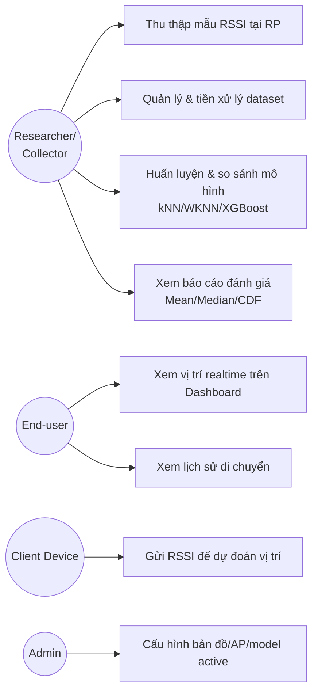
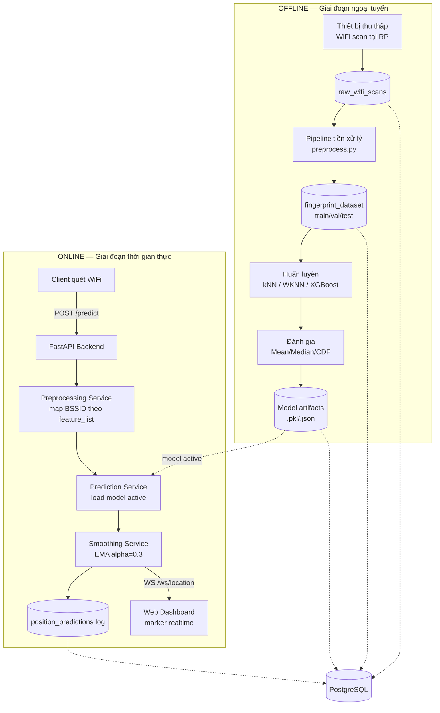
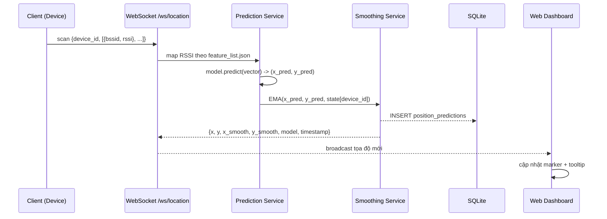
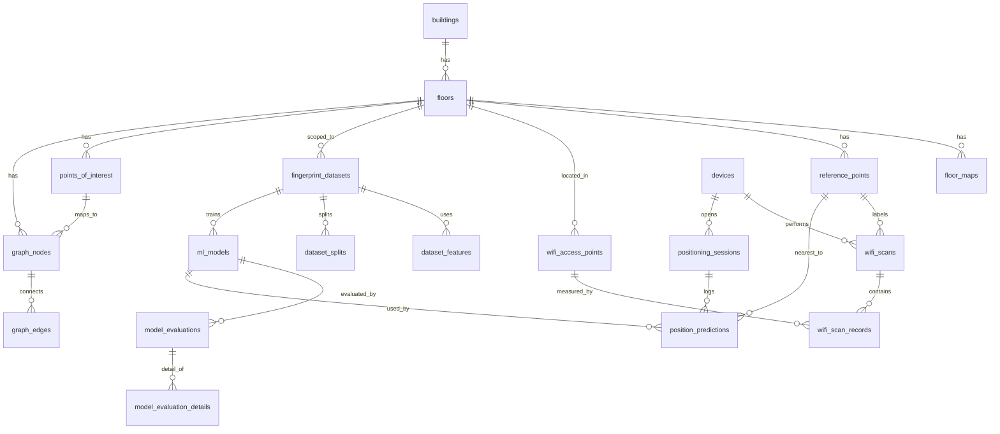

# Phân tích & Thiết kế Hệ thống — Đồ án "Nghiên cứu hệ thống định vị trong nhà và xây dựng ứng dụng" (Nhóm 15)

Bản phân tích & thiết kế hệ thống tổng hợp từ: đề cương của nhóm (`Nhom15_DeCuong_DATN_edited.docx`), kế hoạch phân tích chi tiết (`Kế Hoạch_phantichh_CB.docx`), đề cương/báo cáo đồ án cũ CTK45 mà nhóm kế thừa (`DATN_CTK45_IPS.pdf`), thiết kế Figma (`Design_Figma_SystemIndoor.docx`), và thiết kế CSDL PostgreSQL (`Thiết Kế Database PostgreSQL Cho Dự Án Indoor Positioning System.docx`). Viết theo cấu trúc Chương 2 trong đề cương của nhóm, để có thể chép trực tiếp vào báo cáo.

---

## 2.0. Vị trí đề tài trong dòng kế thừa

Đồ án cũ (CTK45, thư viện tầng 1 ĐH Đà Lạt) đã làm gì, và đồ án của Nhóm 15 kế thừa/khác ở đâu — đây là phần **"điểm mới"** giám khảo sẽ hỏi đầu tiên, nên cần nói rõ ràng, có số liệu đối chứng:

| Khía cạnh | Đồ án cũ (CTK45 – kế thừa) | Đồ án Nhóm 15 (đề xuất) |
|---|---|---|
| Bài toán ML | **Phân lớp** RSSI → RP_ID, sau đó tra tọa độ RP trong DB | **Hồi quy** RSSI → (x, y) trực tiếp — đánh giá được sai số mét liên tục, không bị lượng tử hóa theo lưới RP |
| Mô hình | KNN, WKNN, Random Forest, CNN (Conv1D 16-32-64 + Dense) phân lớp | KNN, WKNN (baseline) + **XGBoost Regression** (2 mô hình con cho x, y) là mô hình chính; Random Forest là phương án so sánh nếu còn thời gian |
| Kết quả đã có (để trích dẫn/so sánh) | Phòng thí nghiệm: RF 97.16%/6.02 m, KNN 89.5%/9 m, WKNN 88.7%/8 m, CNN 92%/5 m. Thực tế: RF 5–8 m, KNN 7–12 m, WKNN 6–11 m, CNN 0–8 m | Mục tiêu: sai số trung bình thấp hơn KNN/WKNN 10–20%, CDF90 giảm rõ rệt so với baseline |
| Dữ liệu | 40 RP, cách nhau ~7 m, 3200 mẫu (80 mẫu/RP × 4 hướng), 13 trường thô, rút gọn còn 37/8 đặc trưng AP, RSSI thiếu = -98 | Kế thừa đúng quy ước: RSSI thiếu = -98, ngưỡng tối thiểu 6 AP/mẫu, 30–80 mẫu/RP; bổ sung 3 cấu hình lựa chọn AP (toàn bộ / ≥20% xuất hiện / top 10–15) và quy tắc chống rò rỉ dữ liệu (fit scaler chỉ trên train) |
| Sản phẩm đầu ra | App di động Flutter, chỉ đường bằng giọng nói, AR/3D (một phần là mở rộng lý thuyết, chưa chắc đã cài đặt) | **Web Dashboard** (không phải mobile), hiển thị vị trí **realtime qua WebSocket** trên sơ đồ mặt bằng — *đã dựng cả app di động, xem bảng dưới* |
| Backend/CSDL | FastAPI (REST) + MongoDB Atlas | FastAPI + WebSocket + **PostgreSQL** — *đã chốt lại là SQLite, xem bảng dưới* |
| Hậu xử lý vị trí | Không đề cập | **EMA smoothing** (alpha = 0.3) để giảm dao động marker |
| Phạm vi | Toàn bộ tầng 1 thư viện, có định hướng mở sang AR/đa nền tảng | Giữ nguyên phạm vi 2D một tầng, **chủ động không** làm đa tầng/GPS/BLE/CNN để tập trung chất lượng mô hình |

**Cách viết "điểm mới" trong báo cáo** (đã đúng hướng theo file kế hoạch): nhấn mạnh **hồi quy tọa độ trực tiếp** thay vì phân lớp RP, **XGBoost** khai thác tốt dữ liệu bảng RSSI, đánh giá bằng **sai số mét chuẩn hóa (CDF)** thay vì accuracy phân lớp, và triển khai **realtime Web Dashboard**. Không nêu "xây dựng app định vị" làm điểm mới vì đồ án cũ đã làm.

✅ **Đã chốt sau khi triển khai.** Bảng trên là ĐỀ XUẤT ban đầu, giữ nguyên làm dấu vết quá trình. Bốn dòng đã đi khác:

| Dòng trong bảng | Đề xuất | Đã dựng | Xem thêm |
|---|---|---|---|
| Backend/CSDL | PostgreSQL | **SQLite** qua `aiosqlite` | mục 2.5 |
| Sản phẩm đầu ra | Web Dashboard, không làm mobile | **ứng dụng di động Flutter là sản phẩm chính** (đề cương bản 24.9); Dashboard web là công cụ giám sát | mục 2.6, 2.7 |
| Hậu xử lý vị trí | EMA `alpha = 0.3` | **đồng thuận không gian** trên 3 lần quét | mục 2.4.1 |
| Web Dashboard | HTML5 + Tailwind CSS | HTML/CSS/JS thuần, **không thư viện ngoài** — phòng bảo vệ có thể không ra được Internet | mục 2.7 |
| Mô hình | XGBoost là mô hình chính | XGBoost vẫn được huấn luyện, đánh giá đầy đủ để đối chứng; mô hình *đang triển khai* là **kNN vân tay k động**, chỉ định bằng `MO_HINH_TRIEN_KHAI` | mục 2.4.1, điểm 6 |

Mâu thuẫn SQLite ↔ PostgreSQL giữa đề cương (`Nhom15_DeCuong_DATN_edited.docx`, mục V) và tài liệu thiết kế CSDL riêng nay đã hết: chốt **SQLite**, đúng như đề cương ghi. Không cần sửa mục V nữa.

Mọi sơ đồ và bảng phía dưới vẫn là bản thiết kế ban đầu. Chỗ nào đã dựng khác thì có mục đối chiếu riêng chỉ ra.

---

## 2.1. Phân tích yêu cầu

### 2.1.1. Tác nhân (Actors)

| Actor | Vai trò |
|---|---|
| **Researcher/Collector** (thành viên nhóm) | Thu thập dữ liệu offline tại các RP, quản lý dataset, huấn luyện & đánh giá mô hình |
| **End-user (Viewer)** | Mở Web Dashboard, xem vị trí hiện tại của mình (hoặc thiết bị test) theo thời gian thực |
| **System/Client device** | Actor phi con người: điện thoại/laptop quét RSSI và gửi lên backend qua HTTP hoặc WebSocket |
| **Admin** (mở rộng) | Cấu hình bản đồ, danh sách AP, chọn model đang active |

### 2.1.2. Use case chính

### 2.1.3. Yêu cầu chức năng (đã nhóm theo module — khớp với 5 chương trong đề cương)

1. **Thu thập & tiền xử lý tín hiệu**: quét RSSI, gắn nhãn RP/tọa độ, chuẩn hóa cột AP theo BSSID, xử lý AP không phát hiện (-98), loại mẫu <6 AP, loại AP nhiễu/hiếm gặp, chia train/val/test không rò rỉ dữ liệu.
2. **Ước lượng tọa độ**: nhận vector RSSI → trả (x, y) bằng model đang active, làm mượt bằng EMA.
3. **Truyền dữ liệu thời gian thực**: WebSocket phát tọa độ mới mỗi khi có dự đoán; REST dùng cho các thao tác không cần realtime.
4. **Hiển thị trực quan**: Dashboard vẽ marker trên sơ đồ mặt bằng, trạng thái kết nối, RSSI panel, thẻ tọa độ hiện tại.
5. **Quản lý thực nghiệm**: lưu vết dataset/model theo phiên bản để tái lập kết quả, so sánh kNN/WKNN/XGBoost bằng bảng & biểu đồ CDF.

### 2.1.4. Yêu cầu phi chức năng

| Loại | Yêu cầu |
|---|---|
| Hiệu năng | Độ trễ dự đoán 1 mẫu (từ lúc nhận RSSI đến khi trả tọa độ) nên < 200 ms; model load **một lần khi khởi động** backend, không load lại mỗi request |
| Độ chính xác | Sai số trung bình XGBoost thấp hơn kNN/WKNN tối thiểu 10–20%; CDF90 < baseline |
| Khả năng tái lập | Mọi dataset/model phải gắn version, có thể huấn luyện lại từ đầu ra cùng kết quả (cố định `random_state=42`) |
| Khả năng mở rộng | Schema và kiến trúc phải chịu được việc thêm tầng/tòa nhà/route-finding sau này mà không đổi core |
| Khả dụng | Nếu mất kết nối WebSocket, Dashboard phải hiển thị rõ trạng thái "Disconnected", không đứng hình marker cũ mà không cảnh báo |
| Bảo mật (mức tối thiểu cho đồ án) | Endpoint ghi dữ liệu training/cấu hình nên có xác thực đơn giản (API key/basic auth); endpoint đọc công khai cho Dashboard |

**Đo được trên bản đã dựng:**

| Yêu cầu | Kết quả |
|---|---|
| Độ trễ < 200 ms | Đạt rất thoải mái: 0,85 ms mỗi mẫu cho mô hình đang chạy, mô hình chậm nhất là Random Forest ở 35,9 ms. Có bước chạy nóng lúc khởi động vì lần `predict` đầu tiên của scikit-learn tốn hơn hẳn |
| XGBoost thấp hơn baseline 10–20% | Tuỳ giao thức. Chia ngẫu nhiên theo lần quét: **không đạt**, cao hơn kNN 14,0% và cao hơn WKNN 36,1%. Bỏ trọn một điểm tham chiếu: **đạt với kNN** (thấp hơn 13,6%), chưa đạt với WKNN (thấp hơn 6,4%). Xem mục 2.4.1 |
| Tái lập được | Đạt: `random_state=42`, và hai lần chạy pipeline cho ra dataset giống hệt **từng byte** |
| Dashboard báo mất kết nối | Đạt: huy hiệu trạng thái đổi ngay khi WebSocket đóng, tự nối lại với thời gian chờ tăng dần |
| Xác thực | **Chưa làm** — không có endpoint ghi dữ liệu training, nhưng Dashboard và WebSocket cũng đang mở hoàn toàn. Ghi trong phần hạn chế đã biết của README |

---

## 2.2. Kiến trúc hệ thống tổng thể

Hệ thống chia 2 luồng: **Offline (huấn luyện)** và **Online (thời gian thực)**, dùng chung tầng dữ liệu.

*Sơ đồ thiết kế ban đầu. Bản đã dựng dùng SQLite thay PostgreSQL và đồng thuận không gian thay EMA — xem bảng "Đã chốt" ở đầu tài liệu.*

**Giải thích các thành phần:**

- **Data Collection**: script/ứng dụng nhỏ (web form hoặc CLI) ghi RSSI thô kèm `rp_id, x, y, device_id, direction, bssid, rssi`.
- **Preprocessing pipeline** (`ml/preprocess.py`): chuẩn hóa AP theo BSSID, xử lý thiếu, lọc mẫu/AP kém, scaling (fit trên train only), xuất `fingerprint_dataset_sorted.csv`, `feature_list.json`.
- **Training pipeline**: huấn luyện song song kNN/WKNN (baseline) và XGBoost (2 mô hình con `model_x`, `model_y`); lưu artifact + `model_metadata.json`.
- **Backend FastAPI**: expose REST (`/predict`, `/map`, CRUD dữ liệu) + WebSocket (`/ws/location`); load model **một lần lúc start** để đảm bảo độ trễ thấp.
- **Smoothing Service**: EMA theo từng `device_id`/`session`, có rule reset nếu mất tín hiệu lâu, giới hạn bước nhảy tối đa.
- **Web Dashboard**: HTML5 + Tailwind CSS, kết nối WebSocket, vẽ marker lên sơ đồ mặt bằng bằng công thức quy đổi `pixel = origin + x*scale`.

---

## 2.3. Thiết kế luồng dữ liệu (Sequence)

**(a) Luồng dự đoán realtime — quan trọng nhất, nên đưa vào báo cáo dưới dạng sequence diagram:**

**(b) Luồng huấn luyện & đánh giá (offline):** Load `fingerprint_dataset` → fit scaler trên train → train kNN/WKNN/XGBoost → predict trên validation/test → tính `mean_error, median_error, cdf_50/75/90` → ghi `model_evaluations` + `model_evaluation_details` (từng mẫu, để vẽ heatmap lỗi) → chọn model tốt nhất, đặt `is_active = true`.

---

## 2.4. Thiết kế mô hình học máy

- **Phát biểu bài toán**: Input = vector RSSI `[AP_1, ..., AP_n]` (thiếu → -98); Output = `(x, y)` mét. Loss/đánh giá chính: `error = sqrt((x_pred-x_true)² + (y_pred-y_true)²)`.
- **Baseline 1 – kNN**: trung bình tọa độ của k mẫu train gần nhất; thử k ∈ {3,5,7,9,11}, distance ∈ {euclidean, manhattan}.
- **Baseline 2 – WKNN**: trọng số `1/(distance+ε)`, ε=1e-6. Dải k bắt đầu từ 2 chứ không phải 1 như kNN: với một láng giềng duy nhất thì trọng số không có gì để cân, WKNN ở k=1 chính là kNN ở k=1 và bảng so sánh mất một mô hình cơ sở.
- **(Tùy thời gian) Random Forest**: `n_estimators` ∈ {100,200,500}, dùng làm mốc so sánh thêm với XGBoost — có sẵn số liệu đối chứng từ đồ án cũ (RF đạt 97.16%/6.02m trong bài toán phân lớp, nên kỳ vọng RF cũng là baseline mạnh trong bài toán hồi quy).
- **Mô hình chính – XGBoost Regression**: train riêng `model_x`, `model_y`; tham số thử `n_estimators∈{100,300,500}`, `max_depth∈{3,5,7}`, `learning_rate∈{0.03,0.05,0.1}`, `subsample/colsample_bytree∈{0.8,1.0}`, `reg_lambda∈{1,5,10}`, `random_state=42`.
- **Chỉ số đánh giá**: Mean/Median/Min/Max/Std error (m), CDF tại 50/75/90%, MAE/RMSE theo từng trục x, y, thời gian dự đoán (ms). Biểu đồ: CDF sai số, so sánh mean error giữa model, heatmap lỗi theo bản đồ, feature importance của XGBoost, sai số theo từng RP.
- **Chia dữ liệu**: cơ bản train/val/test = 70/15/15; nâng cao (nếu có nhiều thiết bị/thời điểm) — device-holdout và time-holdout để kiểm tra tổng quát hóa thực tế (đúng bài học từ đồ án cũ: kết quả phòng thí nghiệm 88–97% nhưng thực tế rớt xuống 5–12m — cần test bằng thiết bị khác/thời điểm khác ngay từ đầu để tránh optimistic bias).
- **Hậu xử lý**: EMA `x_smooth = α·x_new + (1-α)·x_old`, α=0.3 mặc định; reset nếu mất tín hiệu quá lâu; giới hạn bước nhảy tối đa.

---

### 2.4.1. Đối chiếu với bản đã thực hiện

Mục 2.4 ở trên là **thiết kế ban đầu**, giữ nguyên làm dấu vết quá trình. Sau khi
chạy thực nghiệm có sáu chỗ khác đi.

> **Đơn vị.** Các con số ghi "m" ở điểm 1–5 dưới đây thực ra là **đơn vị lưới**
> của Bảng 4 (toạ độ điểm tham chiếu), chưa nhân `0,3508`: ví dụ 3,45 "m" là
> 1,21 m thật. Giữ nguyên để khớp với nhật ký cũ và `reports/tables/`. Điểm 6 đã
> quy ra mét. Mọi số liệu dưới đây đo trên tập test 118
mẫu, chọn mô hình chỉ dựa trên validation.

**1. Hậu xử lý: EMA thay bằng đồng thuận không gian.**

Thiết kế chọn EMA `x_smooth = α·x_new + (1-α)·x_old`. Thực nghiệm cho thấy các ca
sai nặng gần như luôn là *một* lần quét dị thường lẻ loi chứ không phải dao động
đều, mà EMA thì kéo trung bình nên vẫn bị điểm lạc lôi đi. Đồng thuận không gian
chọn dự đoán có tổng khoảng cách tới các dự đoán còn lại nhỏ nhất, nên luôn trả
về một điểm tham chiếu có thật và tự loại điểm lạc.

Đo theo đúng thứ tự thời gian backend nhận, cửa sổ 3. *Đứng yên* gộp mọi lần
quét của một điểm — chặn dưới lý tưởng. *Test* chạy cửa sổ trượt trên tập test,
nhưng mỗi điểm chỉ 3 lần quét. *Chuỗi dài* chạy trên ~17 lần quét mỗi điểm của
train+val, dự đoán ngoài phần nên mô hình chưa thấy mẫu nó đoán — gần với lúc app
quét liên tục nhất, nên là con số nên trích:

| Cách gộp | Đứng yên (40 điểm) | Test (121 mẫu) | Chuỗi dài (681 mẫu) |
|---|---|---|---|
| Một lần quét, không gộp | 3,45 m | 3,45 m · sai 24 | 1,58 m · sai 75 |
| **Đồng thuận không gian** | **1,10 m · sai 3** | **2,69 m · sai 20** | **0,83 m · sai 43** |

Bản trước báo 1,40 m cho cột test vì chạy theo thứ tự dòng trong tệp chứ không
theo thời gian; chạy đúng thứ tự thì cách hoà cũ (lấy dự đoán cũ hơn) còn tệ hơn
không gộp. Nay hoà thì lấy dự đoán mới nhất — chọn trên train+val, cả năm mô
hình đều tốt hơn (kNN vân tay 1,18 → 0,78 m).

Hai tham số `α` và giới hạn bước nhảy vì thế không còn, thay bằng `cua_so_gop`
(số lần quét gộp, mặc định 3) và `reset_after_seconds`.

**2. Thêm mô hình thứ năm không có trong thiết kế.** Dữ liệu chỉ có 40 toạ độ
khác nhau vì thu đúng tại các điểm tham chiếu, nên bài toán gần với phân lớp hơn
hồi quy. `kNN vân tay (Bray-Curtis)` khai thác đúng tính chất đó: tốt nhất trên
validation (2,59 m) nên được triển khai; trên test seed 42 cho 3,45 m, sát kNN
3,44 m và WKNN 3,51 m, còn XGBoost 7,02 m.

Kèm theo đó là một kết quả ngược với giả thiết ban đầu, cần nói thẳng trong báo
cáo: **XGBoost không đạt mục tiêu ở mục 2.1** — thay vì thấp hơn baseline
10–20%, nó cao hơn cả hai. Các con số trên là MỘT cách chia (seed 42). Chia lại
10 seed với cùng tham số (`python -m ml.on_dinh`): kNN vân tay 2,58 ± 0,36 m, kNN
3,41 ± 0,63, WKNN 3,88 ± 0,40, Random Forest 6,61 ± 0,66, XGBoost 6,87 ± 0,38 —
XGBoost thua kNN ở cả 10 seed, kNN vân tay dẫn đầu 9/10. Seed 42 lại là cách chia
xấu bất thường cho kNN vân tay (3,45 m, cao hơn cả 10 seed kia), nên riêng seed 42
nó thua kNN 0,01 m và khoảng tin cậy 95% của hai mô hình chồng nhau (kNN vân tay
2,05–4,96, kNN 2,22–4,74 m). Nguyên nhân là tính
chất dữ liệu nêu trên chứ không phải thiếu tinh chỉnh: vài tham số tối ưu nằm ở
biên lưới, nhưng nới thêm một nấc chỉ đổi sai số validation dưới 0,1 m.

**Mọi con số trong hai đoạn trên đo bằng cách chia ngẫu nhiên theo lần quét, và
cách chia đó có rò rỉ.** Mỗi điểm tham chiếu chỉ được đo trong đúng một phiên
chừng 15 phút, cùng máy, cùng ngày, nên chia ngẫu nhiên khiến cả 40 điểm có mặt
đồng thời ở train lẫn test; 75% bản ghi test có láng giềng train gần nhất (Bray-Curtis,
dữ liệu đã chuẩn hoá) nằm ngay tại điểm của chính nó. Đo lại bằng giao thức
bỏ trọn một điểm tham chiếu (`python -m ml.danh_gia_cheo`, bảng
`reports/tables/model_comparison_bo_diem.csv`) thì **thứ hạng đảo ngược hoàn
toàn**: XGBoost đứng đầu với 14,21 m, còn kNN vân tay tụt xuống 15,98 m.

Hai con số là hai chặn của cùng một sự thật — chia ngẫu nhiên là chặn lạc quan,
bỏ trọn một điểm là chặn bi quan — nên báo cáo phải nêu cả hai kèm giao thức đi
với từng con số. Điều này không gỡ bỏ kết luận ở trên, nhưng nó cho biết kết
luận ấy chỉ đúng trong phạm vi cách chia đã dùng.
XGBoost vẫn được huấn luyện, đánh giá đầy đủ trong bảng so sánh. Mô hình *đang
triển khai* nay là kNN vân tay k động (điểm 6), và `GET /health` luôn cho biết mô
hình nào đang chạy.

**3. Giá trị điền thiếu: −98 thành −96, và nó chuyển vào hợp đồng dữ liệu.**
Không đặt cứng nữa mà tính từ dữ liệu: `min(RSSI) − 1`. Dữ liệu thu được có RSSI
thấp nhất −95 dBm.

Điều quan trọng hơn con số là **nó được ghi ở đâu**. Giá trị này nay nằm trong
`artifacts/feature_list.json` do pipeline sinh ra, và backend đọc lại từ đó lúc
khởi động — một nguồn duy nhất cho cả lúc huấn luyện lẫn lúc chạy thật.

Đồ án CTK45 cho thấy đúng cái giá của việc không làm vậy. Báo cáo của họ trang 42
ghi *"giá trị RSS = −98 được đặt mặc định với các AP không phát hiện được"*, còn
mã nguồn ứng dụng (`wifi_service.dart`, dòng 59) lại điền `?? -100`. Huấn luyện
bằng −98, chạy thật bằng −100: lệch hệ thống trên **mọi** AP vắng mặt của **mọi**
lần quét. Không có gì báo lỗi, vì cả hai đều là số hợp lệ — chỉ có sai số định vị
âm thầm lớn hơn nó đáng phải có.

Hai con số đó nằm ở hai kho mã khác nhau, do hai người viết, cách nhau nhiều
tháng. Đấy chính là lý do dự án này không cho phép bất kỳ tham số tiền xử lý nào
tồn tại ở hai nơi: `missing_rssi_value`, `min_ap_per_scan` và thứ tự 36 cột AP
đều chỉ có một bản trong `feature_list.json`, kèm `ap_columns_sha1` để backend từ
chối khởi động nếu mô hình và hợp đồng đến từ hai lần chạy pipeline khác nhau.

**4. Lưới tham số mở rộng.** Ba lưới trong mục 2.4 có tối ưu rơi đúng vào biên —
`beta` cận trên, `n_neighbors` cận dưới, `reg_lambda` cận dưới — nên đã nới cho
tới khi cực trị nằm hẳn bên trong. Riêng lưới XGBoost giữ đúng 6 tham số như
thiết kế, chỉ thêm giá trị `reg_lambda = 0,5` và `colsample_bytree = 0,6`.

**5. `device_holdout` và `time_holdout` không thực hiện được.** Toàn bộ dữ liệu
thu bằng một máy Samsung SM-S908E, nên `device_holdout` không có gì để tách. Với
`time_holdout` thì vướng hơn: mỗi điểm tham chiếu chỉ được đo trong đúng một
buổi (13/01 đo RP27–RP40, 21/01 đo RP08–RP25, 24/01 đo RP01–RP17), nên tách theo
thời gian đồng nghĩa với tách theo vị trí — tập test sẽ chứa những điểm mà tập
train chưa từng thấy, và bài toán vân tay không trả lời được. Đây là hạn chế của
cách thu dữ liệu, cần khắc phục bằng một đợt đo lại có lặp điểm qua nhiều buổi và
nhiều máy.

**6. Mô hình triển khai đổi sang kNN vân tay k động (24/09/2026).**

Quét k từ 1 đến 61 (`python -m ml.quet_k`) cho thấy không k cố định nào tốt cho cả
hai giao thức: k = 1 tốt nhất khi điểm đã khảo sát, k lớn tốt nhất khi chưa.
`ml/models/fingerprint_knn_dong.py` chọn k theo từng lần quét, dựa trên khoảng
cách Bray-Curtis d1 tới vân tay gần nhất: d1 < ngưỡng thì k = 1, ngược lại k lớn.
Ngưỡng và k lớn tự chọn trong `fit`, chỉ trên dữ liệu học, bằng hai tình huống
giả lập nặng như nhau — chia ngẫu nhiên 80/20 và bỏ trọn từng điểm. Bản đang
triển khai: beta 3,5, ngưỡng 0,19, k lớn 31; khoảng 70% lần quét test dùng k = 1.

| Mô hình, sai số trung bình (mét) | Chia ngẫu nhiên, 10 seed | Bỏ trọn một điểm |
|---|---:|---:|
| kNN vân tay, k = 1 (triển khai cũ) | 0,91 ± 0,13 | 5,71 |
| kNN vân tay, k = 41 | 2,75 ± 0,10 | 4,57 |
| XGBoost | 2,46 ± 0,14 | 5,25 |
| **kNN vân tay, k động** | 1,02 ± 0,12 | 4,84 |

Đổi 0,11 m ở điểm đã khảo sát lấy 0,87 m ở điểm chưa khảo sát. Các cách kết hợp
khác — trung bình hai k, trung bình kNN vân tay và XGBoost, trộn mềm theo hai
ngưỡng — so ở `python -m ml.ket_hop`; trộn mềm chỉ hơn 0,02 m nên không dùng.

Mô hình triển khai **không còn chọn theo validation**: validation chia ngẫu nhiên
nên luôn ưu tiên k = 1. `ml/config.py` có `MO_HINH_TRIEN_KHAI =
"fingerprint_knn_dong"`; đặt `None` để quay về cách cũ.

Lần huấn luyện này XGBoost chọn bộ tham số khác (`colsample_bytree` 1,0,
`reg_lambda` 0,5): các bộ trong lưới gần như hoà trên validation nên khác biệt số
học nhỏ giữa môi trường (Python 3.13 so với 3.14 đã ghim) đủ đổi lựa chọn. Các
mô hình họ kNN và Random Forest cho kết quả y hệt.

---

## 2.5. Thiết kế cơ sở dữ liệu

**Đã chốt: SQLite.** Bản thiết kế ban đầu khuyến nghị PostgreSQL với ba lý do — lưu nhiều phiên bản dataset/model để tái lập thực nghiệm, JSONB cho `hyperparameters`/`metadata`, và dễ mở rộng đa tầng/đa toà nhà. Thực tế triển khai cho thấy cả ba đều chưa cần đến:

- Việc tái lập thực nghiệm giải quyết bằng `artifacts/pipeline_manifest.json` và `model_metadata.json` — hai lần chạy pipeline cho ra tệp giống hệt từng byte, không cần bảng phiên bản trong CSDL.
- `hyperparameters` chỉ được đọc để in báo cáo chứ không truy vấn theo trường, nên JSONB không đem lại gì so với một chuỗi JSON.
- Phạm vi đề tài đã chủ động giới hạn ở một tầng.

Đổi lại, SQLite bỏ được cả một dịch vụ phải cài đặt, nên máy chấm chỉ cần `pip install -r requirements.txt` là chạy. Schema vẫn viết tránh cú pháp riêng của mọi engine, và toàn bộ truy cập CSDL đi qua `backend/repository.py`, nên đổi sang PostgreSQL về sau chỉ phải đổi `DATABASE_URL`. Thực tế hệ thống chỉ dựng **2 bảng** thật cần (`positioning_sessions`, `position_predictions`) trong số 16 bảng của ERD dưới đây.

ERD rút gọn (nhóm theo 6 miền dữ liệu, chi tiết từng trường đã có sẵn trong tài liệu thiết kế CSDL của nhóm — đây chỉ tổng hợp quan hệ):

**Nhóm bảng ưu tiên triển khai theo giai đoạn** (khớp mục 17 trong tài liệu thiết kế CSDL, ánh xạ vào mốc thời gian đề cương ở mục 2.9 bên dưới).

Số ở cột đầu là thứ tự dựng BẢNG CSDL, không phải giai đoạn dự án — cách đánh
số giai đoạn dự án nằm ở PHẦN 5 của `docs/Cau_Truc_Thu_Muc_Du_An.md`:

| Giai đoạn | Bảng | Mục tiêu |
|---|---|---|
| 1 – Lõi định vị | `buildings, floors, floor_maps, reference_points, devices, wifi_access_points, wifi_scans, wifi_scan_records` | Lưu đủ dữ liệu RSSI thô |
| 2 – Machine Learning | `fingerprint_datasets, dataset_features, dataset_splits, ml_models, model_evaluations, model_evaluation_details` | Quản lý dataset/model có versioning |
| 3 – Realtime | `positioning_sessions, position_predictions` | Log dự đoán, phục vụ Dashboard + debug |
| 4 – Mở rộng (nếu còn thời gian) | `points_of_interest, graph_nodes, graph_edges` | Chỉ đường Dijkstra/A* |

Ràng buộc quan trọng cần giữ: `wifi_access_points.bssid` UNIQUE (SSID không dùng làm khóa), `dataset_features.feature_index` unique trong 1 dataset (để backend map đúng thứ tự cột khi predict realtime — đây là điểm dễ gây bug nhất nếu thứ tự train/predict lệch nhau), dữ liệu training bắt buộc có `reference_point_id`, dữ liệu realtime thì không.

---

### 2.5.1. Dữ liệu không gian: sơ đồ mặt bằng và đồ thị đi lại

Mục 2.5 nói về CSDL quan hệ. Hệ thống còn một kho dữ liệu thứ hai không nằm
trong CSDL: **hình học của toà nhà**. Phần này ghi lại nó đến từ đâu và vì sao
không lấy sẵn của đồ án kế thừa.

#### Vì sao không kế thừa GeoJSON của CTK45

Đồ án CTK45 dựng bản đồ Mapbox từ bảy tệp GeoJSON vẽ tay: `POI`, `Room`,
`Hallways`, `Stair`, `Paths`, `Doors`, `Wall`. Cả bảy đều còn trên kho mã của họ
và tải về được. Trước khi dùng, nhóm khớp 40 điểm trong `POI.geojson` của họ với
40 toạ độ nhóm đã đo:

| Phép đo | Kết quả |
|---|---|
| Hộp bao 40 điểm POI của họ, quy từ GPS ra mét | 30,5 × 34,4 m |
| Hộp bao bộ điểm Bảng 4 | **86 × 52 đơn vị lưới** (30,2 × 18,2 m) |
| Khớp Procrustes (quay + co giãn đều + tịnh tiến) | RMS 5,99 đơn vị |
| Khớp affine đầy đủ (hai trục co khác nhau) | RMS **5,08 đơn vị**, lệch lớn nhất 28,55 |
| 780 cặp điểm: khoảng cách GPS (m) ÷ khoảng cách đơn vị lưới | trung vị **0,40**, trải 0,06 đến 1,12 |
| 143 cặp cách nhau dưới 20 đơn vị | sai số tuyệt đối trung bình **7,5 đơn vị** |

Phép affine đầy đủ đã cho phép hai trục co giãn khác nhau và trượt tự do, mà vẫn
còn lệch trung bình 5 đơn vị (1,8 m). Nghĩa là biến dạng **không tuyến tính**: toạ độ đặt bằng
tay chứ không theo một phép chiếu nào. Không có phép biến đổi nào sửa được.

Hệ quả trực tiếp: khoảng cách đo trên bản đồ ấy méo không đều. Ba cặp điểm cách
nhau 16, 12,8 và 18 đơn vị lưới (5,6, 4,5 và 6,3 m) thì GeoJSON cho ra 14,1, 7,3
và 9,3 m. Riêng **trung vị tỉ lệ 0,40 m/đơn vị** của nó lại là một chứng cứ độc lập
cho phép quy đổi ở mục dưới.

Vì vậy nhóm **không** dùng lại `Room`, `Hallways`, `Stair` dù chúng có sẵn sáu đa
giác phòng, năm hành lang và tám khối cầu thang. Vẽ chúng lên sẽ ra một bản đồ
đẹp mà mọi thứ lệch chỗ gần 2 m. `POI.geojson` chỉ được dùng cho hai việc không cần
đúng tỉ lệ: lấy **tên và mô tả** của 40 điểm, và xét **chiều trục x** bằng phép
quay-co-tịnh tiến.

#### Nguồn hình học thay thế

Nhóm trích hình học từ chính `Map.png` — sơ đồ mặt bằng tầng 1 do CTK45 số hoá,
là thứ duy nhất của họ có hình dạng đúng. Công cụ `tools/trich_ban_do.py` chạy một
lần rồi commit kết quả vào `data/reference/ban_do_tang1.json`, nên backend chỉ
đọc JSON và không cần thư viện xử lý ảnh lúc chạy thật.

**Phép biến đổi toạ độ ↔ pixel được kiểm bằng hai phép đo độc lập.** Lưới chấm
trong ảnh trải đúng 1000 px ngang và 605 px dọc, trong khi hộp bao bộ điểm tham
chiếu là 86 × 52 đơn vị — cho 11,628 và 11,635 px/đơn vị. Hai trục tính riêng mà
khớp tới 4 chữ số có nghĩa: lưới chấm chính là hệ toạ độ Bảng 4. Nó KHÔNG cho biết
một đơn vị dài bao nhiêu mét — xem mục kế tiếp.

**Chiều trục cũng chốt bằng bằng chứng, không bằng quy ước.** Trục y hướng lên:
toà nhà thắt eo ở giữa, theo chiều này đoạn eo ứng với y ∈ [6,4; 21,3] và cả 8
điểm trong khoảng đó đều có |x| ≤ 30 — vừa lọt; chiều ngược lại buộc đoạn eo
phải chứa hai điểm ở |x| = 43 m, rộng hơn cả eo. Trục x không lật: khớp 39 điểm
với GPS trong `POI.geojson` cho RMS 3,15 m khi không lật và 13,84 m khi lật.

#### Đối chứng bằng ảnh Google Maps — phương vị toà nhà

`Map.png` vẽ toà nhà thẳng trục nên tự nó **không chứa thông tin hướng**. Muốn
biết trục sơ đồ chỉ về đâu ngoài đời phải lấy từ nguồn khác. Nhóm dùng ảnh khu
thư viện trên Google Maps: Google luôn hướng bắc lên trên, và khối nhà trong lớp
vector là đa giác đo đạc chứ không phải hình vẽ tay.

Đo trên khối chứa nhãn *"Trung tâm Thông tin - Thư viện"*, ba đường độc lập:

| Cách đo | Phương vị trục +x |
|---|---:|
| Hộp chữ nhật nhỏ nhất bao khối | 338,25° |
| Trục chính PCA của chính khối đó | 340,35° |
| Hình 21 CTK45, hai điểm cùng cạnh `y = 0` | 336,88° |
| **Trung bình** (biên độ 3,5°) | **338,5°** |

Ba chỗ khớp thêm, đều là kiểm chứng chứ không phải giả định:

- Cả ba khối nhà nhìn thấy trong ảnh đều **cùng một phương vị**, đúng kiểu quy
  hoạch một khuôn viên.
- Tỉ lệ hộp bao khối thư viện là **1,76**, so với **86/52 = 1,65** của bộ dữ
  liệu — lệch 6%, tức hình dạng 86 × 52 đứng vững trước một nguồn hoàn toàn
  bên ngoài.
- Trục +y chỉ về **tây-tây-nam**, đúng phía Google đặt *"Bãi Giữ Xe Cổng Sau"*.
  Mô tả của RP34 trong `reference_points.csv` ghi cửa sau *"dẫn ra bãi đỗ xe cổng
  sau"* — hai nguồn không liên quan nhau mà chỉ về cùng một hướng.

Phép đo này sửa một con số đang sai trong ứng dụng: `LaBan.gocBacSoDo` để 22°,
lấy từ độ nghiêng nhìn bằng mắt trên ảnh chụp báo cáo CTK45. **22° đúng là góc
nghiêng của lưới nhà so với trục bắc-nam, nhưng nó không phải phương vị của trục
+y** — dùng nhầm thì nón hướng trên sơ đồ lệch khoảng 226°, gần như ngược. Giá
trị đúng là 248,5°.

Ảnh chụp không kèm thước tỉ lệ, nên **nguồn này chỉ kiểm được hướng và tỉ lệ
hình dạng, không kiểm được kích thước tuyệt đối**.

#### Một đơn vị lưới dài bao nhiêu mét

Bản trước coi mỗi đơn vị Bảng 4 là một mét, dựa vào câu *"khoảng cách trung bình
giữa hai vị trí tham chiếu lân cận là 7 mét"* của CTK45. Câu ấy nằm trong đoạn
chép từ một bài báo khác — đoạn ở trang 72 mang tiêu đề "nhận diện ngôn ngữ ký
hiệu" và ghi 3.200 vectơ, 4 thiết bị, không khớp bộ dữ liệu này. Trang 44 báo cáo
viết "giá trị dùng để quy đổi theo:" rồi bỏ trống: chính CTK45 thừa nhận toạ độ
cần quy đổi, nhưng con số bị mất.

Hệ quả đo được: coi đơn vị là mét thì tuyến Cầu thang → Căn tin dài 55,7–72,6 m
(tuỳ bản toạ độ), trong khi người đi thực địa ước 35–50 bước. Bốn nguồn độc lập cho cùng một câu trả lời:

| Nguồn | m / đơn vị lưới |
|---|---|
| **Hình 7 CTK45** — bốn kích thước dọc 4 + 5,2 + 8,8 + 1,6 = 19,6 m trên đường bao cao 55,87 đơn vị | **0,3508** |
| Đa giác toà thư viện trên OpenStreetMap (4.191 m²): mặt bằng lọt trọn trong nhà, đặt đúng phương vị 338,5° | ≤ 0,35 (ở 1,0 chỉ 74% lọt) |
| GPS của 40 điểm trong `POI.geojson` CTK45 | trung vị 0,40; bề ngang 30,5 m / 86 = 0,355 |
| Ước lượng thực địa 35–50 bước cho Cầu thang → Căn tin | 0,33–0,55 |

Hệ thống dùng **0,3508**: công cụ tính lại từ đường bao `Map.png` và ghi vào khoá
`ty_le_quy_doi`. Hai con số khác trong Hình 7 không dùng được: nhãn "0.9m" giữa
hai chấm lưới cho 0,21 — mâu thuẫn với chính bốn kích thước dọc; nhãn chiều
ngang bị chữ "O" che mất chữ số đầu. Toạ độ vẫn giữ đơn vị lưới để không đụng dữ
liệu, mô hình và hợp đồng API; khoảng cách trả ra mới nhân tỉ lệ. Sai số định vị
ở mục 2.4 tính trên toạ độ Bảng 4 nên cũng là đơn vị lưới.

#### Đồ thị đi lại

Nút của đồ thị là chính các điểm tham chiếu, vì **RP nằm trên chỗ đi được theo
định nghĩa**: phải có người đứng đúng đó cầm máy quét mới đo ra được toạ độ.

Cạnh thì cần thêm sơ đồ, vì hai điểm gần nhau vẫn có thể có tường ở giữa. Công cụ
dựng mặt nạ tường từ `Map.png` rồi **gán nhãn vùng liên thông**; hai điểm nối
thẳng khi đoạn thẳng giữa chúng nằm trọn trong một vùng — **đồ thị tầm nhìn**,
223 cặp. Tuyến nhờ vậy chỉ rẽ qua điểm mốc khi thật sự có vật cản. Không có tham
số ngưỡng nào phải chỉnh tay.

So với bản trước (mỗi điểm chỉ nối 3 điểm gần nhất), trên cả 946 cặp: độ vòng
(quãng đường ÷ đường thẳng) trung vị 1,62 → 1,12, trung bình 2,20 → 1,30; số
chặng trung bình 7,0 → 2,6; không cặp nào dài ra vì đồ thị mới chứa trọn đồ thị
cũ. RP20 (cầu thang tây) tới Căn tin từ 88,6 đơn vị qua 8 chặng còn nối thẳng 55,7.

#### Chỉ đường trên lưới đi lại — A* và Dijkstra cải tiến

Đồ thị điểm tham chiếu vẫn còn hai nguồn sai: tuyến bắt đầu từ RP gần nhất chứ
không từ chỗ người dùng đứng, và buộc phải đi qua các RP. Đường ngắn nhất trong
mặt bằng có vật cản chỉ bẻ hướng ở **góc lồi của vật cản**, nên đồ thị chỉ đường
lấy nút là 286 góc lồi dò từ mặt nạ `Map.png` cộng 44 RP, cạnh là 9.449 cặp nhìn
thấy nhau, kể cả 15 cạnh cửa giả định. Mỗi truy vấn thêm đúng vị trí người dùng (kéo vào lối đi nếu rơi trúng
tường hay kệ) rồi chạy A* với heuristic khoảng cách thẳng tới đích gần nhất, hoặc
Dijkstra — hai cách cho cùng quãng đường vì heuristic không bao giờ ước lượng quá.

Đánh giá bằng `python -m tools.danh_gia_chi_duong`, mốc là Dijkstra trên lưới
điểm ảnh 80 hướng cộng cạnh cửa — một phương pháp khác hẳn, sai số rời rạc tối đa
khoảng 0,5%. Mốc không biết luật `chi_noi` (RP01, RP03) nên 908 cặp chịu luật đó
lệch có chủ ý (TB 1,01 m); cột cuối bảng tính trên 3.492 cặp còn lại:

| 4.400 cặp (vị trí ngẫu nhiên, khu vực), cùng tỉ lệ | Sai TB | p90 | Lớn nhất | Ca sai > 1 m |
|---|---|---|---|---|
| Đồ thị RP, neo RP gần nhất (không tới được WC) | ∞ (trung vị 1,57 m) | ∞ | ∞ | 66,4% |
| Lưới đi lại, A* hoặc Dijkstra (cả 4.400 cặp) | 0,23 m | 0,68 m | 8,89 m | 7,4% |
| **Lưới đi lại, bỏ cặp chịu luật `chi_noi`** | **0,03 m** | **0,06 m** | **0,30 m** | **0%** |

A* mở trung bình 27,4 nút so với 165,8 của Dijkstra. Trên tập test của mô hình
đang triển khai (cửa sổ trượt 3 lần quét, 1.331 cặp), quãng đường hiển thị từ vị
trí DỰ ĐOÁN so với quãng đường thật từ vị trí THẬT: cách cũ đúng như ứng dụng từng
hiện sai trung vị **27,6 m**; đồ thị RP đổi đúng tỉ lệ trung vị 0,78 m (không tới được
WC); lưới đi lại sai trung bình **0,79 m**, trung vị 0,03 m. Phần còn lại gần như toàn bộ đến từ những lần mô
hình đoán nhầm khu vực.

Giới hạn: tuyến ôm sát góc vật cản nên là **cận dưới** của quãng đường đi bộ thật.
Không chừa khoảng cách an toàn được: chừa 10 cm là RP22 đã bị kệ sách nhốt, tức
bản vẽ không chính xác tới cỡ đó.

`Map.png` vẽ tường nhưng **không vẽ cửa**, nên chặn hết cạnh cắt tường thì đồ thị
k=3 vỡ thành mảnh rời. Vòng nối tự động (mỗi lần chọn cạnh ngắn nhất giữa hai mảnh —
chỗ nhiều khả năng có cửa nhất) đã chọn sáu cửa nay cố định trong `CUA_CU`, cộng bảy
cạnh nhóm chỉ định; cửa là cạnh nối đúng hai điểm, không mở lối trên mặt nạ. Tất cả
ghi riêng vào khoá `cua_gia_dinh`, **không trộn** vào phần suy ra được từ ảnh, để ra thực địa
còn biết cái nào cần đối chiếu. Đây là hạn chế đã biết, nêu trong README.

Đối lập với CTK45 ở đúng chỗ này: mã của họ nạp `Paths.geojson` — tức hành lang
**đi được** — vào biến `walls` rồi dùng làm vật cản, nên phép kiểm chặn hoạt động
ngược với ý định. Chi tiết ở mục 2b.2 của
`Phan_Tich_Ky_Thuat_DoAnCu_va_Cai_Tien.md`.

#### Một phép biến đổi, ba ngôn ngữ

Cùng phép đổi toạ độ ↔ pixel được dùng ở Python (backend và công cụ), Dart (ứng
dụng di động) và JavaScript (Dashboard); Dart còn giữ tỉ lệ mét để hiện khoảng cách
tới từng khu vực. Lệch một hằng số ở một nơi thì cùng một toạ
độ hiện ra hai chỗ khác nhau trên hai màn hình, mà triệu chứng nhìn y hệt "mô
hình đoán sai" nên rất khó lần ra.

Cả ba lấy số từ `ban_do_tang1.json`, gồm cả số hạng dịch trục — số hạng này từng
viết trần ở cả ba nơi mà không tệp nào khai nó. Nay nó có tên (`goc_met_x`) và được
neo vào chính giá trị `x` nhỏ nhất trong bảng toạ độ đã đo.

---

## 2.6. Thiết kế API & giao thức realtime

| Method | Endpoint | Mô tả |
|---|---|---|
| POST | `/wifi-scans/training` | Ghi 1 lần quét offline gắn với RP |
| POST | `/predict` | Nhận `{device_id, scan:[{bssid,rssi}]}` → trả `{x, y, x_smooth, y_smooth, model, timestamp}` |
| WS | `/ws/location` | Kênh realtime: client gửi scan, server phát tọa độ đã làm mượt |
| GET | `/map` | Trả kích thước bản đồ, RP, POI, ảnh nền |
| GET | `/floors/{id}/reference-points` | Danh sách RP theo tầng |
| GET | `/models` , `/models/active` | Danh sách model, model đang dùng |
| POST | `/models/{id}/activate` | Đổi model active |
| GET | `/model-evaluations?model_id=` | Kết quả đánh giá để vẽ biểu đồ báo cáo |
| GET | `/predictions?device_id=&from=&to=` | Lịch sử vị trí (màn hình History) |
| GET | `/graph?floor_id=` , POST `/route` | (Mở rộng) chỉ đường |

Định dạng JSON response `/predict` giữ nguyên như trong tài liệu kế hoạch của nhóm — đây là hợp đồng dữ liệu giữa model và frontend, nên khóa cứng sớm để không phải sửa lại Dashboard nhiều lần.

### 2.6.1. Đối chiếu với bản đã dựng

Đã dựng 8 endpoint. Bốn nhóm trong bảng trên chưa làm, và đều có lý do:

| Endpoint đề xuất | Tình trạng |
|---|---|
| `POST /predict`, `WS /ws/location`, `GET /map`, `GET /predictions` | Đã dựng, đúng hợp đồng dữ liệu ở trên. WebSocket đang tạm tắt (`WEBSOCKET=false`): Dashboard hỏi `/predictions` mỗi 2 giây, ứng dụng gửi `POST /predict` |
| `GET /graph`, `POST /route` | Đã dựng, dù bảng ghi là "mở rộng". `/route` chạy A* và trả kèm `chi_dan` — chỉ dẫn rẽ từng chặng. Nhận `den_nhom` để chạy A* đa đích: tự chọn điểm đích theo đường chim bay thì sai ở 5,1% truy vấn trên đồ thị tầm nhìn (đồ thị k=3 cũ: 16,1%, tệ nhất gấp bốn) |
| `GET /health`, `GET /map/so-do.png`, `GET /` | Thêm mới: trạng thái mô hình, ảnh sơ đồ, và trang Dashboard phục vụ ngay từ uvicorn |
| `POST /wifi-scans/training` | Không làm. Buổi thu bổ sung 06/09/2026 ghi thẳng ra CSV bằng `tools/thu_van_tay.py` qua `adb`, nên không cần đường ghi dữ liệu huấn luyện qua API |
| `GET /floors/{id}/reference-points` | Không làm. Chỉ có một tầng, `GET /map` trả luôn mọi điểm |
| `GET /models`, `/models/active`, `POST /models/{id}/activate`, `GET /model-evaluations` | Không làm. Thuộc phần quản lý phiên bản mô hình qua giao diện; mô hình active chọn lúc huấn luyện và ghi vào `model_metadata.json` |

---

## 2.7. Thiết kế giao diện (UI/UX)

Theo đúng cấu trúc module trong file Figma đã phác thảo — hệ thống lại theo độ ưu tiên MVP:

**MVP (bắt buộc, làm trước):**
- **Dashboard** (màn hình quan trọng nhất): sơ đồ mặt bằng chiếm 60–70%, marker vị trí + hiệu ứng pulse, panel trạng thái WebSocket/model/latency, thẻ tọa độ hiện tại, panel RSSI theo AP.
- **Data Collection**: chọn RP trên bản đồ, form nhập RP_ID/x/y/device, bảng RSSI realtime, nút start/stop/save scan.
- **Settings** cơ bản: cấu hình API/WebSocket, danh sách AP, model đang chạy.

**Bản hoàn chỉnh (sau MVP):**
- **Dataset Management**: thống kê mẫu/AP/dữ liệu thiếu, trạng thái pipeline tiền xử lý.
- **Model Training**: danh sách kNN/WKNN/XGBoost với trạng thái, mean/median/90th error, nút Train/Evaluate/Deploy.
- **Evaluation**: biểu đồ so sánh mean error, CDF 50/75/90, bảng kết quả, bản đồ heatmap lỗi.
- **History**: replay đường di chuyển, bảng log time/x/y/error/model.

**Mở rộng sau (không bắt buộc)**: đa tầng, nhiều người dùng cùng lúc, chỉ đường, quản lý nhiều khu vực, phân quyền admin/researcher/viewer.

Bố cục chung: sidebar trái (điều hướng module) + top bar (trạng thái hệ thống) + main content + right panel (log/metrics realtime) — giữ nguyên theo thiết kế Figma đã có, việc này đã khá hoàn chỉnh, không cần chỉnh sửa nhiều.

### 2.7.1. Đối chiếu với bản đã dựng

**Dashboard gộp thành một trang, không chia bảy màn.** Bảy tệp HTML từng được
tạo theo bảy module ở trên nhưng không tệp nào có nội dung, mà dữ liệu chúng
định hiển thị thì máy chủ chưa có endpoint tương ứng — giữ lại chỉ là giữ bảy
đường dẫn 404 có tiêu đề. Trang hiện tại gồm: sơ đồ mặt bằng với 44 điểm tham
chiếu và marker thiết bị kèm vệt đã đi, bảng thiết bị đang kết nối, hộp chỉ
đường, biểu đồ hiệu quả bước gộp, và bảng lịch sử định vị. Tức là phần MVP và
hai màn Evaluation, History đã có mặt dưới dạng khối trong một trang.

**Data Collection, Dataset Management, Model Training chưa làm** — cùng lý do với
các endpoint tương ứng ở mục 2.6.1.

**Không dùng Tailwind CSS** như mục V đề cương ghi: trang viết bằng HTML/CSS/JS
thuần. Tailwind qua CDN cần Internet mà phòng bảo vệ có thể không ra được mạng
ngoài; bản build tại chỗ thì phải thêm Node vào một dự án còn lại thuần Python.
Giao diện chỉ có một trang nên phần tiện lợi của Tailwind cũng không còn nhiều.

**Sản phẩm chính: ứng dụng di động Flutter** 5 màn hình (Trang chủ, Bản đồ, Chi
tiết khu vực, Tìm kiếm, Cài đặt), song ngữ Việt/Anh, sáng/tối, theo đề cương bản
24.9. Ứng dụng tự quét WiFi, hiển thị vị trí và chỉ đường; Web Dashboard ở trên
chỉ là công cụ giám sát. Xem `mobile/README.md`.

Màn Bản đồ dựng theo bố cục CTK45 ở mục 4.4.3 — hàng chip lọc loại khu vực trên
sơ đồ mặt bằng — nhưng khác họ ở hai chỗ. Nhãn chip lấy thẳng từ trường `nhom`
của dữ liệu khảo sát chứ không từ một bảng loại viết riêng, nên không thể trôi
khỏi dữ liệu như `CategoryModel` của họ. Và chip ngoài nhóm đang chọn thì làm
mờ chứ không tô đậm thêm: cách của họ chỉ đổi nền các nhãn cùng loại nên màn
hình càng dày đặc hơn sau khi lọc.

Tuyến đường vẽ bằng chuỗi chấm cách đều 1,2 m theo `duong_di` — danh sách nút
đầy đủ, không phải `chi_dan` vốn đã gộp các chặng đi thẳng — kèm thẻ tổng quãng
đường. Con số trên thẻ là tổng độ dài các cạnh **đã lọc tường** trong hệ mét đo
thực địa, khác thẻ "Tổng khoảng cách" của CTK45 vốn cộng trên hình học GeoJSON
vẽ tay (mục 2.5.1). Tuyến neo ở điểm xuất phát lúc bấm và không tự tính lại khi
người dùng đi tiếp; chấm vị trí vẫn chạy thời gian thực nên vẫn thấy mình đang
ở đâu trên tuyến.

---

## 2.8. Rủi ro & giải pháp (tổng hợp, ưu tiên theo mức ảnh hưởng)

| Rủi ro | Giải pháp |
|---|---|
| RSSI dao động mạnh → marker nhảy | EMA smoothing, thu nhiều mẫu/RP, đánh giá riêng lúc đông/vắng người |
| Model tốt trên test nhưng kém khi thực tế (bài học trực tiếp từ đồ án cũ: 88-97% phòng lab nhưng 5-12m thực tế) | Bắt buộc test bằng thiết bị khác (`device_holdout`) và thời điểm khác (`time_holdout`), không chỉ dùng random split |
| AP thay đổi/biến mất theo thời gian | Dùng BSSID cố định, đánh dấu `is_active=false` cho AP tạm thời, cho phép retrain |
| Web realtime bị trễ | Load model 1 lần lúc start, không load mỗi request; giới hạn tần suất gửi RSSI |
| Lệch thứ tự cột feature giữa lúc train và lúc predict | `dataset_features.feature_index` là nguồn sự thật duy nhất, backend luôn map theo `feature_list.json` gắn với model đang active |

### 2.8.1. Rủi ro đã xảy ra thật, và thêm một rủi ro không lường trước

| Rủi ro | Thực tế |
|---|---|
| RSSI dao động → marker nhảy | Xảy ra đúng như dự đoán, nhưng dạng khác: không phải dao động đều mà là **một lần quét dị thường lẻ loi**. EMA không xử lý được vì nó kéo trung bình; đồng thuận không gian mới loại được. Xem mục 2.4.1 |
| `device_holdout` / `time_holdout` | **Không thực hiện được** với bộ dữ liệu kế thừa — một máy đo, mỗi điểm chỉ đo một buổi. Đây là hạn chế phải nêu trong báo cáo, không phải việc bỏ sót |
| Đánh giá lúc đông/vắng người (mục 4.3 đề cương) | Chưa làm được: bộ dữ liệu không ghi số người có mặt lúc đo |
| Lệch thứ tự cột feature | Đã chặn bằng `ap_columns_sha1` trong `model_metadata.json`; lệch là backend không khởi động được chứ không chạy tiếp rồi trả toạ độ sai |
| **Không lường trước:** quét thiếu AP mà mô hình vẫn trả toạ độ tự tin | Mô hình cho ra toạ độ với mọi vector đầu vào, kể cả vector toàn giá trị điền-khi-thiếu. Đo thực địa: 23 AP nhìn thấy, khớp 0, hệ thống vẫn khẳng định người dùng đứng trong thư viện. Đã chặn bằng ngưỡng `min_ap_per_scan`, trả 422 |

---

## 2.9. Ánh xạ vào lộ trình 12 mốc trong đề cương (Aug–Nov 2026)

Cột "Mốc" chép đúng mục VII của đề cương. Cột cuối là tình trạng tính tới
01/09/2026.

| # | Mốc đề cương | Thời gian | Nội dung kỹ thuật tương ứng | Tình trạng |
|---|---|---|---|---|
| 1 | Phân tích đề tài, khảo sát tài liệu | 12/08–19/08 | Chốt schema DB (SQLite, mục 2.5), chốt kiến trúc mục 2.2 | Xong |
| 2 | Tìm hiểu dữ liệu RSSI, thống kê và tiền xử lý | 20/08–31/08 | `ml/preprocess.py`, 12 bước, `feature_list.json` | Xong |
| 3 | Mô hình cơ sở kNN, WKNN | 01/09–08/09 | `ml/models/knn.py`, `wknn.py`, `evaluate.py` | Xong |
| 4 | XGBoost và tinh chỉnh siêu tham số | 09/09–20/09 | `ml/models/xgboost_model.py`, quét lưới 648 tổ hợp | Xong |
| 5 | Báo cáo tiến độ lần 1 | 25/09–30/09 | Bảng so sánh mô hình, quét k, k động, lý thuyết tìm đường | Sẵn sàng |
| 6 | Thực nghiệm, so sánh và đánh giá | 01/10–15/10 | Heatmap lỗi theo điểm, phân bố sai số, hậu xử lý gộp | Xong phần đo; còn mục 4.3 (mật độ người) chưa làm được |
| 7 | Back-end FastAPI, tích hợp mô hình và WebSocket | 16/10–31/10 | 8 endpoint, `/ws/location`, `BoGop` | Xong |
| 8 | Front-end Web Dashboard và ghép nối | 01/11–10/11 | `frontend/index.html`, phục vụ ngay từ uvicorn | Xong |
| 9 | Kiểm thử, hoàn thiện và viết báo cáo | 11/11–15/11 | 175 test Python, 101 test Flutter | Đang làm |
| 10 | Báo cáo tiến độ lần 2 | 16/11–18/11 | — | Chưa tới |
| 11 | Sửa chữa, hoàn thiện đồ án | 19/11–24/11 | — | Chưa tới |
| 12 | Báo cáo bảo vệ trước hội đồng | 25/11–30/11 | Demo Dashboard realtime + bảng so sánh mô hình | Chưa tới |

Các mốc 7 và 8 đã làm xong sớm hơn kế hoạch. Theo đề cương bản 24.9, mốc 8 gồm
ứng dụng di động Android (sản phẩm chính) cùng trang Web giám sát; cả hai đã chạy.

---|---|
| 12/08–19/08: Phân tích đề tài | Chốt schema DB (đã chốt SQLite, mục 2.5), chốt kiến trúc ở mục 2.2 |
| 20/08–31/08: Thống kê/tiền xử lý dữ liệu | Triển khai bảng "Giai đoạn 1 – Lõi định vị", pipeline `preprocess.py` |
| 01/09–08/09: Baseline kNN/WKNN | Cài `train_knn.py`, `train_wknn.py`, `evaluate.py` |
| 09/09–20/09: XGBoost | `train_xgboost.py` + tuning theo bảng tham số ở mục 2.4 |
| 25/09–30/09: Báo cáo tiến độ 1 | Có bảng so sánh model + biểu đồ CDF sơ bộ |
| 01/10–15/10: Thực nghiệm/so sánh | Bổ sung `device_holdout`/`time_holdout`, heatmap lỗi |
| 16/10–31/10: Backend + WebSocket | Triển khai `/predict`, `/ws/location`, Smoothing Service |
| 01/11–10/11: Frontend Dashboard | Triển khai màn hình MVP ở mục 2.7 |
| 11/11–24/11: Kiểm thử & hoàn thiện | Test thực tế đứng yên/di chuyển/đông-vắng người |
| 25/11–30/11: Bảo vệ | Chuẩn bị demo Dashboard realtime + bảng so sánh model |

---

## Việc tiếp theo có thể làm

1. Vẽ các sơ đồ trên (use-case, kiến trúc, sequence, ERD) thành hình ảnh để chèn
   thẳng vào Word thay vì mã Mermaid.
2. Nếu báo cáo cần trình bày SQL DDL: viết theo schema ĐANG chạy — hai bảng trong
   `backend/database.py` — chứ không theo 16 bảng của ERD đầy đủ, vì bản 16 bảng
   đã bị thu lại có chủ đích (lý do ở docstring đầu `backend/database.py`).
