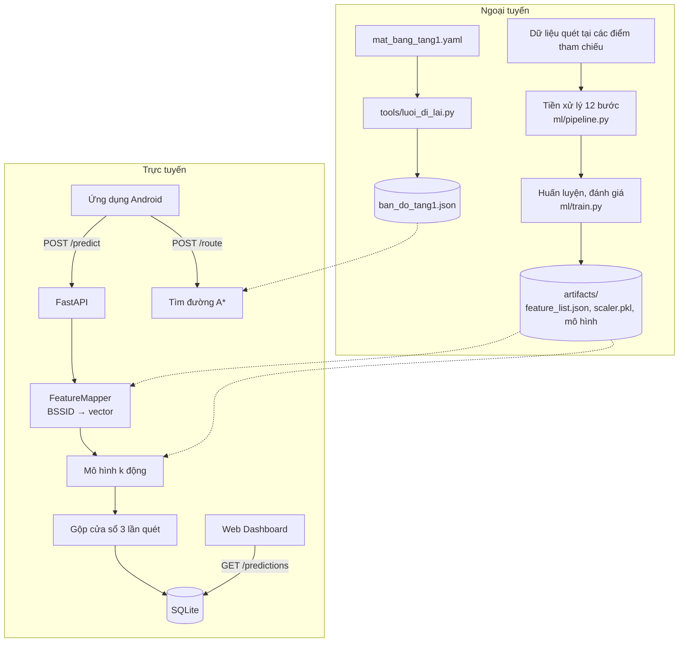
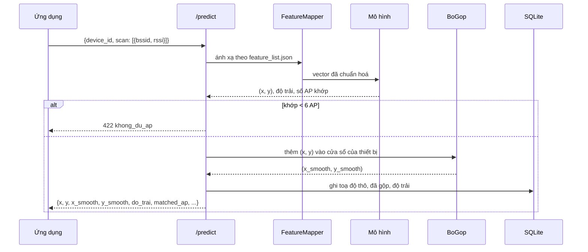
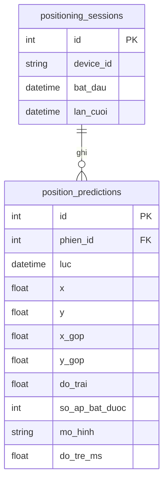

# Thiết kế hệ thống

Tài liệu mô tả thiết kế của hệ thống định vị trong nhà bằng WiFi Fingerprinting cho tầng 1
Thư viện Đại học Đà Lạt: yêu cầu, kiến trúc, mô hình, dữ liệu không gian, chỉ đường, API và
giao diện. Cách cài đặt và kết quả thực nghiệm xem `README.md`.

## 1. Yêu cầu

### 1.1. Tác nhân

| Tác nhân | Vai trò |
|---|---|
| Người dùng | Dùng ứng dụng Android để biết mình đang ở đâu, tra cứu khu vực và được chỉ đường |
| Quản trị viên | Theo dõi các thiết bị đang định vị và lịch sử vị trí trên Web Dashboard |
| Nhóm phát triển | Thu thập dữ liệu, tiền xử lý, huấn luyện và đánh giá mô hình |

### 1.2. Chức năng

1. **Định vị**: nhận một lần quét WiFi, trả toạ độ `(x, y)` kèm độ trải (chỉ báo độ tin cậy);
   từ chối khi lần quét khớp quá ít AP đã biết.
2. **Làm mượt vị trí**: gộp vài lần quét gần nhau của cùng thiết bị để loại lần quét lạc.
3. **Bản đồ**: cung cấp sơ đồ tầng 1, danh sách điểm tham chiếu kèm tên, nhóm khu vực, mô tả.
4. **Chỉ đường**: tìm đường ngắn nhất từ vị trí hiện tại tới một điểm hoặc một khu vực, kèm
   chỉ dẫn rẽ từng bước.
5. **Giám sát**: hiển thị các thiết bị đang định vị và lịch sử vị trí.
6. **Thực nghiệm tái lập được**: tiền xử lý, huấn luyện, đánh giá chạy lại bằng lệnh, cố định
   `random_state = 42`.

### 1.3. Yêu cầu phi chức năng

| Loại | Yêu cầu | Đáp ứng |
|---|---|---|
| Độ trễ | Một lần định vị dưới 200 ms | Khoảng 10 ms cho cả `/predict`; mô hình nạp một lần lúc khởi động |
| Nhất quán huấn luyện ↔ chạy thật | Thứ tự cột AP, giá trị điền thiếu, ngưỡng AP chỉ có một nguồn | `artifacts/feature_list.json`; backend từ chối khởi động nếu mô hình và tệp này lệch nhau (so `ap_columns_sha1`) |
| Tái lập | Chạy lại cho cùng kết quả | Hai lần chạy pipeline cho dữ liệu giống hệt từng byte |
| Triển khai | Chạy được không cần Internet và không cài dịch vụ ngoài | SQLite; Dashboard không nạp thư viện từ CDN |

## 2. Kiến trúc

Hệ thống có hai giai đoạn dùng chung các tệp trong `artifacts/`:



| Thành phần | Công nghệ | Mã nguồn |
|---|---|---|
| Ứng dụng di động | Flutter (Android) | `mobile/` |
| Backend | FastAPI, SQLAlchemy async, SQLite | `backend/` |
| Web Dashboard | HTML, CSS, JavaScript (ES module) | `dashboard/` |
| Máy học | scikit-learn, XGBoost, pandas, NumPy | `ml/` |

Backend chia ba tầng: `routers/` nhận request và kiểm schema, `services/` chứa nghiệp vụ (dự
đoán, gộp, tìm đường, chế độ demo), `repository.py` là nơi duy nhất đọc ghi CSDL.

## 3. Luồng định vị



- **Ánh xạ theo BSSID.** Client gửi cặp `{bssid, rssi}` chứ không gửi mảng số, nên thứ tự gửi
  không ảnh hưởng. BSSID hạ chữ thường trước khi tra. BSSID lạ và RSSI ngoài khoảng vật lý bị
  bỏ qua. BSSID lặp lại lấy trung bình, đúng như bước pivot lúc huấn luyện.
- **Ngưỡng AP.** Mô hình luôn trả một toạ độ, kể cả khi vector toàn giá trị điền thiếu. Vì vậy
  backend từ chối lần quét khớp dưới `min_ap_per_scan` = 6 AP, cũng là ngưỡng đã dùng để loại
  mẫu huấn luyện.
- **Gộp.** `BoGop` giữ 3 dự đoán gần nhất của mỗi thiết bị và trả dự đoán có tổng khoảng cách
  tới các dự đoán còn lại nhỏ nhất (đồng thuận không gian). Một lần quét lạc không kéo lệch kết
  quả như khi lấy trung bình hay EMA. Thiết bị im lặng quá 30 giây thì bắt đầu cửa sổ mới.
- **Độ trải.** Kèm mỗi toạ độ, mô hình trả độ trải của lần quét đó (mục 4.4). Ứng dụng vẽ
  thành quầng mờ quanh chấm vị trí.
- **Chu kỳ.** Ứng dụng gọi quét mỗi 1 giây và chờ đúng sự kiện quét xong của hệ thống. Máy đo phải
  tắt điều tiết quét Wi-Fi; còn bật thì Android chỉ cho 4 lần quét mỗi 2 phút. Kể cả khi tắt,
  firmware vẫn có thể trả lại kết quả cũ: trên vivo X300 số liệu thật mới khoảng 7,6 s một lần khi
  đang nối WiFi, 2 s khi không nối mạng nào (README, mục Hạn chế). Với nhịp này REST là đủ; hệ
  thống không dùng WebSocket.

**Định vị trên máy (Mô hình cục bộ).** Tuỳ chọn trong Cài đặt của ứng dụng, mặc định tắt. Khi
bật, ứng dụng tự làm các bước ánh xạ, chặn ngưỡng AP, mô hình và gộp ở trên, không chờ máy chủ:

- Mô hình kNN k động không có trọng số cần học; "mô hình" là bảng vân tay cùng vài tham số.
  `ml.xuat_mo_hinh` xuất phần này ra `mobile/assets/model/k_dong.json` (khoảng 790 KB): danh
  sách 36 BSSID, giá trị điền thiếu, tham số min-max, 2.668 vân tay đã nâng mũ beta, nhãn và 40
  toạ độ, ngưỡng d1, k lớn. Bước học vẫn chạy trên máy tính như cũ.
- Mã Dart dịch đúng thuật toán Python. Hai bài kiểm giữ hai bên khớp nhau: `flutter test` so
  với 200 lần quét test do Python đoán (lệch dưới 10⁻⁶ đơn vị lưới), còn pytest báo lỗi khi tệp
  trong app lệch với mô hình vừa học.
- Ứng dụng vẫn gửi `POST /predict` nhưng không chờ trả lời: máy chủ tiếp tục ghi CSDL cho
  Dashboard và cho phân tích sau buổi đo, còn vị trí trên điện thoại không phụ thuộc mạng.
- Đo trên vivo X300 (bản release, 200 lần quét): một lần đoán trên máy trung vị 0,72 ms; gọi
  API qua WiFi nội bộ khứ hồi trung vị 58 ms, trong đó mô hình trên máy chủ 3,3 ms. Cả hai đều
  nhỏ so với nhịp số liệu WiFi mới (2–8 s), nên lợi ích chính là không cần mạng. Không dùng NPU (LiteRT):
  kNN chỉ là phép tính khoảng cách, không phải mạng nơ-ron.
- Độ trải cũng tính trên máy, cùng công thức với Python (lệch dưới 10⁻⁵ đơn vị lưới).
- Bản đồ và chỉ đường vẫn lấy từ máy chủ.

## 4. Tiền xử lý và mô hình

### 4.1. Tiền xử lý

`ml/pipeline.py` chạy 12 bước. Bước 9 (chia tập) chạy sớm, ngay sau bước 4, vì các bước 5, 7,
8, 10 đều học tham số từ dữ liệu và chỉ được nhìn tập train.

| Bước | Việc |
|---|---|
| 1 | Nạp dữ liệu thô, kiểm tra, bỏ số đọc RSSI ngoài khoảng vật lý |
| 2–3 | Gom các dòng thành lần quét, pivot thành bảng vân tay (mỗi AP một cột) |
| 3b | Ghép đợt B (dữ liệu đã xử lý của ba máy còn lại) |
| 4 | Ghép toạ độ thật từ `data/reference/reference_points.csv` |
| 9 | Chia train/validation/test 70/15/15, phân tầng theo điểm tham chiếu |
| 5 | Giữ AP xuất hiện ở ít nhất 20% lần quét train (36 AP) |
| 6 | Loại lần quét bắt được dưới 6 AP |
| 7 | Điền AP vắng mặt bằng giá trị tính từ train (−100 dBm) |
| 8 | Lọc nhiễu Hampel (k = 3 MAD) theo từng điểm tham chiếu, chỉ trên train |
| 10 | Chuẩn hoá min-max, fit trên train |
| 11 | Ghi hợp đồng dữ liệu `feature_list.json` và `scaler.pkl` |
| 12 | Ghi bộ dữ liệu cuối `fingerprint_dataset_sorted.csv` |

### 4.2. Mô hình

| Mô hình | Mô tả |
|---|---|
| kNN | Trung bình toạ độ của k mẫu gần nhất |
| WKNN | Như kNN, trọng số nghịch đảo khoảng cách |
| Random Forest | Hồi quy hai đầu ra |
| XGBoost | Hai mô hình con cho x và y |
| **kNN k động (Dynamic-k kNN)** | Khoảng cách Bray-Curtis, k chọn theo từng lần quét |

Tham số mỗi mô hình chọn bằng tìm kiếm lưới trên tập validation. Riêng mô hình triển khai
được chỉ định (`MO_HINH_TRIEN_KHAI` trong `ml/config.py`), vì validation chia ngẫu nhiên nên
luôn ưu tiên mô hình nhớ đúng điểm đã khảo sát (k = 1).

**k động.** Bộ dữ liệu chỉ có 40 toạ độ khác nhau, nên bài toán gần với nhận lại điểm đã khảo
sát. k = 1 tốt nhất khi người dùng đứng đúng điểm đã đo; k lớn tốt nhất khi đứng giữa các
điểm. Mô hình đo khoảng cách Bray-Curtis d1 tới vân tay gần nhất: d1 nhỏ hơn ngưỡng thì dùng
k = 1, ngược lại dùng k lớn để nội suy. Ngưỡng và k lớn chọn trong `fit`, chỉ trên dữ liệu học,
bằng hai tình huống giả lập: chia ngẫu nhiên 80/20 và bỏ trọn từng điểm.

### 4.3. Đánh giá

Sai số là khoảng cách Euclid giữa toạ độ dự đoán và toạ độ thật, quy ra mét, kèm trung bình,
trung vị và CDF tại 50/75/90%. Ba giao thức:

| Giao thức | Câu hỏi | Lệnh |
|---|---|---|
| Chia ngẫu nhiên, 10 seed | Nhận lại chỗ đã đo, cùng phiên đo | `ml.on_dinh` |
| Bỏ trọn một điểm | Đứng ở chỗ chưa từng đo | `ml.danh_gia_cheo` |
| Khác đợt đo | Chỗ đã đo nhưng khác máy, khác thời điểm | `ml.khac_dot` |

Mỗi điểm tham chiếu chỉ được đo trong một phiên, nên chia ngẫu nhiên có rò rỉ: lần quét học
và kiểm cùng phiên. Đó là chặn lạc quan; bỏ trọn một điểm là chặn bi quan.

### 4.4. Độ tin cậy của mỗi lần định vị

Lúc chạy không có toạ độ thật nên không tính được sai số, chỉ ước lượng được mô hình chắc tới
đâu. Chỉ báo chọn là **độ trải**: độ lệch chuẩn có trọng số của toạ độ k lớn láng giềng,

    tâm = Σ pᵢ · cᵢ,   độ trải = √( Σ pᵢ · |cᵢ − tâm|² )

với pᵢ là phần trọng số (nghịch đảo khoảng cách Bray-Curtis) của điểm tham chiếu i, cᵢ là toạ
độ điểm đó. Láng giềng dồn một chỗ thì độ trải nhỏ; rải ra hai cánh nhà thì độ trải lớn. Luôn
tính bằng k lớn, kể cả khi đoán bằng k = 1.

So với sai số thật trên ba giao thức, độ trải là chỉ số tốt nhất trong bốn chỉ số đã thử (độ
trải, d1, số AP bắt được, tỉ lệ phiếu của điểm cao nhất): Spearman +0,46 (khác đợt A → B), +0,43
(B → A), +0,25 (bỏ trọn một điểm). Chia ba nhóm theo độ trải, sai số trung bình tăng đều, ví dụ
A → B 3,28 / 5,02 / 6,49 m. Không đổi được thành bán kính có độ phủ cố định: bán kính 68% học
trên giao thức này phủ 43–89% ở giao thức khác. Vì vậy độ trải chỉ là chỉ báo tương đối; API
trả nguyên giá trị theo đơn vị lưới, không kèm phần trăm.

## 5. Cơ sở dữ liệu

SQLite, tự tạo bảng lúc khởi động. Chỉ lưu lịch sử định vị; điểm tham chiếu và mô hình đã có
nguồn là `data/reference/` và `artifacts/`.



Một phiên là một thiết bị định vị liên tục; vắng quá 30 giây thì mở phiên mới. Bảng dự đoán
giữ cả toạ độ thô lẫn toạ độ đã gộp để đo hiệu quả bước gộp, và độ trải để sau buổi đo thực
địa so với sai số thật. CSDL tạo trước khi có cột `do_trai` được tự thêm cột lúc khởi động,
dòng cũ để trống. Thời điểm lưu theo UTC. Bật WAL
để ghi nhanh và đọc không chặn ghi.

## 6. Dữ liệu không gian

### 6.1. Nguồn hình học

Mặt bằng khai báo một nơi, `data/reference/mat_bang_tang1.yaml`, theo số viên gạch đếm tại chỗ;
toạ độ viết bằng số hoặc biểu thức theo mốc đã đo, phần chưa đo ghi nguồn (ảnh, vệ tinh, đoán)
và vẽ nét đứt. Hai công cụ đọc tệp này:

- `tools/ve_so_do_tang1.py` vẽ sơ đồ SVG cho ứng dụng (sáng, tối) và Dashboard, kèm danh sách
  nhãn địa điểm (tên, biểu tượng, nhóm điểm tham chiếu hoặc mô tả và lối vào).
- `tools/luoi_di_lai.py` vẽ mặt nạ đi được (4 điểm ảnh mỗi đơn vị lưới), dò góc lồi của vật cản,
  các cặp nút nhìn thấy nhau, ghi vào `data/reference/ban_do_tang1.json`.

Backend chỉ đọc JSON, không cần thư viện xử lý ảnh lúc chạy.

### 6.2. Hệ toạ độ

Toạ độ dùng đơn vị lưới của bảng điểm tham chiếu: x từ −43 đến 43, y từ 0 đến 52, y = 0 ở
phía cửa ra vào, y hướng lên.

- **Lưới ↔ pixel.** Sơ đồ SVG giữ khung pixel của `Map.png` (bản số hoá của CTK45): lưới chấm
  trải 1000 × 605 px trên hộp bao 86 × 52 đơn vị, 11,628 và 11,635 px/đơn vị ở hai trục.
- **Chiều trục.** Toà nhà thắt eo ở giữa; chỉ khi y hướng lên thì mọi điểm trong đoạn eo mới
  lọt trong tường. Khớp 39 điểm với toạ độ GPS cho sai số 3,15 khi không lật trục x, 13,84 khi
  lật.
- **Lưới ↔ mét.** Một đơn vị bằng 0,3508 m, tính từ bốn kích thước dọc ghi trên bản vẽ
  (19,6 m trên 55,87 đơn vị). Hai nguồn độc lập khớp: đa giác toà nhà trên OpenStreetMap chỉ
  chứa trọn mặt bằng khi tỉ lệ ≤ 0,35; GPS của các điểm tham chiếu cho trung vị 0,40.
- **Hướng bắc.** Trục +x của sơ đồ có phương vị 338,5°, đo trên ảnh vệ tinh bằng ba cách độc
  lập (lệch nhau trong 3,5°). Ứng dụng dùng góc này (trục +y: 248,5°) để xoay nón hướng la bàn.

Phép đổi toạ độ ↔ pixel có ở công cụ vẽ (Python), ứng dụng (Dart) và Dashboard (JavaScript),
cùng bộ hằng số.

## 7. Chỉ đường

**Đồ thị.** Đường ngắn nhất trong mặt bằng có vật cản chỉ bẻ hướng ở góc lồi của vật cản. Vì
vậy nút của đồ thị là 167 góc lồi của mặt nạ đi được cộng 44 điểm tham chiếu, 3.599 cạnh nối
mọi cặp nút nhìn thấy nhau. Mặt nạ cho đi trong vỏ toà, phòng, sàn, cầu thang; chặn bởi tường,
lan can, mép sàn khác mức, giếng, quầy, cột, kệ; cầu thang chỉ lên xuống ở hai đầu; cửa mở khe
qua tường. Chỉ giữ mảng sàn liền với sảnh cửa chính.

**Truy vấn.** Vị trí người dùng được thêm vào đồ thị như một nút tạm; nếu rơi vào tường hay
kệ thì kéo về ô đi được gần nhất. Sau đó chạy:

- **A\*** (mặc định), heuristic là khoảng cách thẳng tới đích gần nhất. Heuristic không bao
  giờ ước lượng quá nên cho cùng quãng đường như Dijkstra nhưng mở ít nút hơn nhiều.
- **Dijkstra**, để đối chứng.

Đích là một khu vực thì tìm đa đích: dừng ở điểm đầu tiên của khu vực lấy ra khỏi hàng đợi,
tức điểm gần nhất theo đường đi chứ không theo đường chim bay. Đích là toạ độ (phòng không có
điểm tham chiếu, như phòng sau quầy) thì đích được kéo về điểm đi được gần nhất và thêm vào đồ
thị như một nút tạm; cách đích dưới 2 m coi như đã tới.

**Chọn đích trong ứng dụng.** Nhiều khu vực có ở cả hai cánh nhà (Khu đọc, Khu tự học, Sảnh
chờ, Ban công). Chỗ nào mỗi bên có ảnh và mô tả riêng thì tách thành địa điểm riêng: hai WC, hai
cầu thang lên tầng 2, cửa chính và lối ra cửa sau. Mở khu vực từ Trang chủ hay Tìm kiếm thì gửi tên khu vực, máy chủ
chọn chỗ gần nhất theo đường đi. Chạm một nhãn trên sơ đồ thì người dùng đã chọn một chỗ cụ
thể: ứng dụng gửi điểm tham chiếu cùng khu gần nhãn nhất (`den_rp`), hoặc lối vào của chính
nhãn đó (`den_x`, `den_y`). Khoảng cách trong popup, trạng thái "đang ở đây" và báo đã tới đều
tính theo chỗ đã chọn.

**Chỉ dẫn.** Tuyến được chia thành các chặng; góc quay giữa hai chặng phân loại thành
`di_thang` (≤ 20°), `chech_trai/phai` (≤ 60°), `re_trai/phai` (≤ 135°) và `quay_dau`. Bước đầu
là `bat_dau` vì chưa biết người dùng quay mặt hướng nào. Các chặng đi thẳng liên tiếp được gộp,
chặng dưới 0,5 m dồn vào chặng kề. API trả mã hướng; ứng dụng dịch sang tiếng Việt hoặc Anh.

**Kết quả.** Trên 1.892 truy vấn giữa các điểm tham chiếu, A* mở trung bình 15 nút, Dijkstra
107, cùng quãng đường. So với đường ngắn nhất trên lưới mịn, riêng thuật toán lệch trung bình
0,16 m; quãng đường báo khi đứng ở vị trí mô hình đoán so với từ vị trí thật lệch trung bình 1,45 m,
lớn nhất 29 m khi vị trí đoán rơi sang sàn khác mức bên kia lan can.

## 8. API

| Phương thức | Đường dẫn | Mô tả |
|---|---|---|
| GET | `/health` | Mô hình đang chạy, số đặc trưng, giá trị điền thiếu, cửa sổ gộp |
| POST | `/predict` | Định vị một lần quét |
| GET | `/predictions` | Lịch sử vị trí, lọc theo `device_id`, `gioi_han` từ 1 đến 1000 |
| GET | `/map` | Phạm vi, điểm tham chiếu (tên, nhóm, mô tả, thư mục ảnh), thống kê đồ thị, `met_moi_don_vi` |
| GET | `/graph` | Các cặp điểm tham chiếu nhìn thấy nhau |
| POST | `/route` | Chỉ đường tới điểm tham chiếu, khu vực hoặc toạ độ |
| GET | `/` | Web Dashboard |

Ví dụ `POST /predict`:

```json
// Yêu cầu
{"device_id": "a1b2", "scan": [{"bssid": "f4:6d:2f:...", "rssi": -62}, ...]}

// Phản hồi 200
{"device_id": "a1b2", "x": -22.0, "y": 34.0, "x_smooth": -22.0, "y_smooth": 34.0, "do_trai": 9.6,
 "model": "fingerprint_knn_dong", "timestamp": "2026-10-01T07:29:47Z",
 "matched_ap": 32, "scan_count": 3, "latency_ms": 4.2}

// Phản hồi 422 khi khớp quá ít AP
{"detail": {"loi": "khong_du_ap", "so_ap": 2, "toi_thieu": 6}}
```

Ví dụ `POST /route`:

```json
// Yêu cầu: điểm đầu là toạ độ hoặc tu_rp; đích là den_rp hoặc den_nhom
{"tu_x": 5.0, "tu_y": 30.0, "den_nhom": "WC phía căn tin", "thuat_toan": "a_sao"}

// Phản hồi 200 (rút gọn)
{"tu": "RP19", "den": "RP42", "quang_duong_m": 16.06, "so_chang": 2, "so_nut_mo": 54,
 "duong_di": [{"rp_id": "", "x": 5.0, "y": 30.0, "ten": "", "nhom": ""}, ...],
 "chi_dan": [{"tu_rp": "RP19", "den_rp": "RP42", "den_ten": "WC phía căn tin", "huong": "bat_dau",
              "goc_do": 0.0, "khoang_cach_m": 12.75}, ...]}
```

Lỗi: 404 khi điểm hoặc khu vực không tồn tại, 409 khi không có đường, 422 khi sai schema.

## 9. Giao diện

### 9.1. Ứng dụng di động

| Màn | Nội dung |
|---|---|
| Trang chủ | Khu vực đang đứng, danh sách khu vực gần nhất |
| Bản đồ | Sơ đồ tầng 1, chấm vị trí kèm quầng độ trải, nón hướng la bàn, nhãn địa điểm, tuyến đường, lọc theo nhóm khu vực |
| Tìm kiếm | Tìm khu vực và địa điểm theo tên hoặc nhóm, không phân biệt dấu |
| Cài đặt | Mô hình cục bộ, máy chủ (PROD, DEMO, tuỳ chỉnh), nhịp số liệu WiFi mới, ngôn ngữ, chế độ sáng/tối, quyền truy cập |

Chạm một khu vực mở popup có ảnh, giới thiệu và nút Chỉ đường. Định vị chạy liên tục khi ứng
dụng mở và dừng khi chạy nền.

Nhãn trên sơ đồ theo kiểu Google Maps: biểu tượng trắng trên nền tròn màu theo loại, tên bên
phải. Nhãn đặt theo toạ độ màn hình nên không xoay, không phóng theo sơ đồ; nhãn phụ chỉ hiện
khi phóng đủ to, nhãn đè lên nhãn đã đặt thì ẩn. Mọi nhãn chạm được và mở cùng một popup. Địa
điểm không có điểm tham chiếu (phòng sau quầy, sảnh chờ, ban công) cũng có trong tìm kiếm và
chỉ đường theo toạ độ lối vào.

Cử chỉ bản đồ: kéo rồi buông thì trôi ngắn (vận tốc giảm còn 1/e sau 0,18 s); xoay chỉ bắt
đầu khi hai ngón quay quá khoảng 13° và quay bằng 70% góc ngón tay để khỏi xoay nhầm khi chụm;
khối thư viện luôn nằm trong khung nhìn. Hiệu ứng kính chỉ dùng cho thanh điều hướng và nút nổi; nội dung
dùng nền đặc để dễ đọc.

### 9.2. Web Dashboard

Một trang gồm: thẻ trạng thái hệ thống, sơ đồ với điểm tham chiếu, cạnh đồ thị và thiết bị
đang định vị kèm vệt đường, bảng thiết bị, hộp thử chỉ đường, biểu đồ độ dịch giữa toạ độ thô
và toạ độ đã gộp, bảng lịch sử (kèm độ trải quy ra mét). Trang hỏi `/predictions` mỗi 2 giây; thiết bị im lặng quá 20
giây bị ẩn khỏi sơ đồ.
